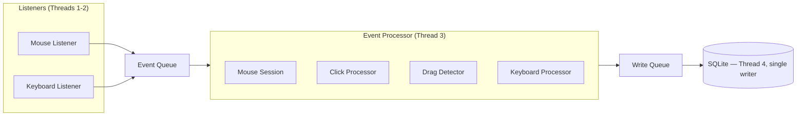

# CLAUDE.md — InputDNA

Project-specific guidance for Claude Code. **Inherits ALL rules from the
monorepo root [CLAUDE.md](../../../CLAUDE.md)** (mandatory workflow, Priorities,
Rules #1–#18, markdown guidelines, version/commit system, build pipeline,
py-spy profiling) — read that first; only project facts and deltas live here.

---

## Project Facts (never re-derive these)

- **Platform:** UVirtual — an AI system that builds a complete virtual replica
  of a user by capturing, learning and reproducing behavioral patterns. Each
  DNA module records one dimension of behavior; together they cross the
  uncanny valley.
- **This repo is InputDNA** — the first, active module: records exactly how the
  user moves the mouse and types, trains ML models on that data, and can replay
  the behavior indistinguishably.
- **Stack:** Python, PySide6, pynput, SQLite (WAL mode).
- **Core principle:** the RECORDER IS DUMB — capture and store, nothing else.
  All analysis, validation, aggregation happens in post-processing.
- **Phases:** 1 Recorder (current) → 2 Post-processing & ML training →
  3 Validation (shadow mode) → 4 Replay engine (MouseMux execution).

### DNA Modules

| Module | Domain | Status |
|--------|--------|--------|
| **InputDNA** | Mouse & keyboard behavior | Active (this repo) |
| VoiceDNA | Speech rhythm, tone, pauses | Planned |
| GamingDNA | Reflexes, strategy, play style | Planned |
| ExpressionDNA | Facial expressions | Planned |
| MotionDNA | Body movement, gestures | Planned |
| UV Avatar | Virtual twin from all modules | Future |

## Thread Architecture (do not change without discussion)

4 threads, no shared state except thread-safe queues. Single DB writer
eliminates all SQLite concurrency issues.

## Project Deltas to the Root Rules

- **Config home (Rule #4):** all thresholds, paths and tunable values live in
  `config.py`. Before hardcoding anything, ask "should this be in config.py?"
- **Folder docs use `__folder.md`** (double underscore), not the root's triple
  underscore — e.g. `database/__database.md`, `listeners/__listeners.md`. Root
  `README.md` keeps its name. MD-first also applies to NEW files (create the
  folder doc before the script).
- **Commit versioning is hook-driven:** the `commit-msg` git hook reads the
  first word of the message, writes it to `version.py`, and aborts the commit
  if the message does not start with `X.Y.Z`. Patch increments by 10 within a
  logical group (`0.4.240 → 0.4.250`).
- Communicate in Serbian (Latin); everything in files stays English.

## Technical Reference

### Timestamps — never mix the two

| Type | Source | Used for | Column |
|------|--------|----------|--------|
| `perf_counter_ns` | `time.perf_counter_ns()` | precise intervals (monotonic, integer ns) | `t_ns` |
| Wall clock | `datetime.now().isoformat()` | human readability only | `timestamp` |

Wall clock can jump (NTP, DST). **NEVER use it for timing calculations.**

### Scan codes vs virtual keys

ML training uses **scan codes** (physical key position, layout-independent) —
physical finger distance determines typing delay. Virtual keys (character
produced, layout-dependent) are for display names only.

### Database

SQLite + WAL (read while writing) · single writer thread · batched inserts
(100 records or 2s, whichever first) · `perf_counter_ns` in `t_ns`, ISO 8601
in `timestamp` · no indexes by default (added in post-processing if needed).

### Performance Targets

| Metric | Target |
|--------|--------|
| CPU idle / active | < 0.5% / < 2% |
| RAM | < 30 MB |
| DB write latency | < 50 ms per batch |
| Event processing | < 0.5 ms per event |
| DB growth | ~150–200 MB/month |
| Startup | < 1 s |

## No-Go Zones

**NEVER:** single-row DB inserts (always batch) · float timestamps · wall clock
for intervals · concurrent DB writes · analysis in the recorder · hardcoded
thresholds · skipping error logging for I/O / DB / OS calls · deleting data
without asking.

**Don't change without discussion:** the 4-thread queue architecture · the
single DatabaseWriter · scan-code keyboard tracking · the `perf_counter_ns`
strategy · the recorder-is-dumb philosophy.

## Key Documentation

- [implementation-plan.md](implementation-plan.md) — full system design, schema
- [README.md](README.md) — ecosystem, document index, quick start
- Folder docs (read before modifying a module): `database/`, `listeners/`,
  `processors/`, `models/`, `utils/`, `ui/`, `gui/`, `data/`
