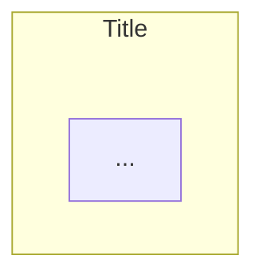
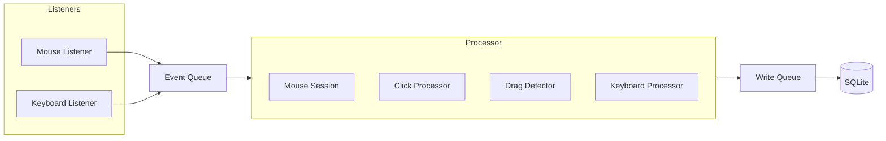
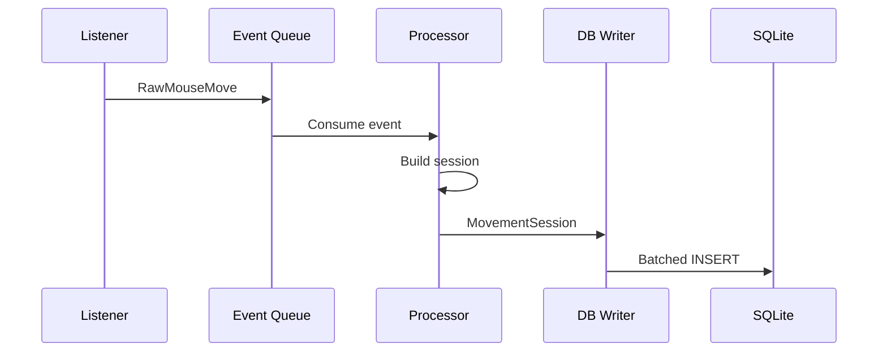

# CLAUDE.md

This file provides guidance to Claude Code (claude.ai/code) when working with code in this repository.

---

## PROJECT OVERVIEW

**Personalized PC Behavior** is a system for recording, learning, and replaying personalized human input patterns. It captures how YOU specifically move the mouse and type on the keyboard, trains ML models on that data, and can replay your behavior indistinguishably from the real thing.

**Project Phases:**
```
Phase 1: Recorder (Current Focus)
    └── Capture raw mouse + keyboard input → SQLite

Phase 2: Post-Processing & ML Training (Future)
    └── Analyze recorded data → Train personal models

Phase 3: Validation (Future)
    └── Shadow mode testing → Similarity scoring

Phase 4: Replay Engine (Future)
    └── ML-generated input → MouseMux execution
```

**Core Architecture:** Multi-threaded recorder with batched SQLite writes

**Core Principle:** Recorder is DUMB — capture and store, nothing else. All analysis, validation, aggregation happens in post-processing.

**Key Documentation:**
- [implementation-plan.md](implementation-plan.md) — Full system design, schema, file descriptions
- [README.md](README.md) — Project overview, document index, quick start
- [docs/](docs/) — 7 detailed specification documents (mouse, keyboard, ML, replay, etc.)

**Folder READMEs (MUST READ before modifying a module):**
- [database/README.md](database/README.md) — Schema, writer, WAL mode
- [listeners/README.md](listeners/README.md) — Mouse & keyboard hooks, scan codes
- [processors/README.md](processors/README.md) — Session detection, click grouping, keyboard processing
- [models/README.md](models/README.md) — Raw events vs processed records
- [utils/README.md](utils/README.md) — Timing, keyboard layout, hotkeys
- [ui/README.md](ui/README.md) — System tray icon
- [gui/README.md](gui/README.md) — PySide6 desktop GUI (login, dashboard, validation)
- [data/README.md](data/README.md) — Runtime database location

---

## THREAD ARCHITECTURE

```
Main Thread ──── tray_icon (blocks until quit)
    │
    ├── Thread 1: mouse_listener (pynput hook)
    │       └── pushes RawMouse* events to event_queue
    │
    ├── Thread 2: keyboard_listener (pynput hook)
    │       └── pushes RawKey* events to event_queue
    │
    ├── Thread 3: event_processor (consumes event_queue)
    │       ├── mouse_session.py
    │       ├── click_processor.py
    │       ├── drag_detector.py
    │       └── keyboard_processor.py
    │       └── pushes processed records to write_queue
    │
    └── Thread 4: db_writer (consumes write_queue)
            └── batched INSERT to SQLite
```

4 threads. No shared state except thread-safe queues. Single DB writer eliminates all SQLite concurrency issues.

---

## MANDATORY WORKFLOW

**CRITICAL:** Follow this workflow for EVERY task.

### Before Starting Work — ASK QUESTIONS

Before writing ANY code or making ANY changes:

1. **Read the task carefully** — Understand what is being asked
2. **Identify ambiguities** — What is unclear? What could be interpreted multiple ways?
3. **Read relevant README.md files** — Check documentation of the module you'll modify
4. **Read implementation-plan.md** if architectural context is needed
5. **Ask questions** — NEVER assume, ALWAYS verify:
   - "Should I modify existing file X or create new one?"
   - "You mentioned Y — did you mean Z or something else?"
   - "I see multiple approaches — which do you prefer?"
6. **Propose approach** — Explain HOW you will solve it
7. **Only after confirmation** → Start work

**Example:**
```
User: "Fix the session detection"

❌ WRONG: "I'll refactor the session code..." [starts coding immediately]

✅ CORRECT: "Before I start, let me clarify:
   1. Which specific behavior is wrong — idle timeout, click ending, or something else?
   2. Let me read processors/README.md and mouse_session.py first.
   3. Should the fix also update the implementation plan?"
   [waits for answers]
```

---

## DEVELOPMENT RULES

### Important Rules (Must Follow)

#### Rule #1: No Hardcoded Values

**Before hardcoding ANY value, ASK:** "Should this be in config.py?"

```python
# ❌ FORBIDDEN
TIMEOUT = 300
MIN_DISTANCE = 5

# ✅ REQUIRED
import config
timeout = config.SESSION_END_TIMEOUT_MS
min_dist = config.DRAG_MIN_DISTANCE_PX
```

All thresholds, paths, and tunable values live in `config.py`. No other file should contain magic numbers.

**When to hardcode:** Only constants that NEVER change (`PI = 3.14159`), enum values, and loop counters.

---

#### Rule #2: No Backward Compatibility

**When refactoring, update ALL callers. NEVER add "backward compatibility" wrappers!**

```python
# ❌ FORBIDDEN — wrapper for "compatibility"
def old_method(self):  # Kept for compatibility
    return self.new_method()

# ✅ REQUIRED — Update all callers, delete old method
```

**Procedure:**
1. Search for ALL callers
2. Update EACH caller to use new API
3. Delete old method completely

---

#### Rule #3: No Defensive Programming for Impossible Scenarios

**Before adding try/except, ASK:** "Can this scenario actually happen?"

```python
# ❌ FORBIDDEN — checking impossible scenario
def process_move(self, event):
    if event is None:  # Impossible! Listener never sends None
        return

# ✅ REQUIRED — trust initialization and internal guarantees
def process_move(self, event):
    self._points.append(PathPoint(event.x, event.y, event.t_ns))
```

**When defensive code IS appropriate:** External input, file I/O, database operations, OS API calls.

**Principle:** If scenario is impossible, let it fail loudly. Don't hide bugs with silent fallbacks.

---

#### Rule #4: No Duplicate Code

**Always consider creating a parent class or shared utility.**

**Before creating ANY new class or method, ASK:**
- "Does similar functionality already exist somewhere?"
- "Will we have more classes/methods like this in the future?"
- "Should I create a base class for shared logic?"
- "Can I extend an existing class instead of creating a new one?"

```python
# ❌ FORBIDDEN — same logic in multiple processors
class ClickProcessor:
    def check_timeout(self, t): ...

class MouseSessionDetector:
    def check_timeout(self, t): ...  # DUPLICATE!

# ✅ REQUIRED — shared base or utility
class BaseTimeoutProcessor:
    def check_timeout(self, t): ...
```

---

#### Rule #5: Documentation-Driven Development

**Every folder has its README.md. Read it before modifying, update it after.**

**Folder structure:**
```
database/
├── README.md          ← Read this FIRST
├── __init__.py
├── schema.py
└── writer.py
```

**Before creating a new file:**
1. Read the folder's README.md
2. Understand existing patterns
3. Create the file
4. Update README.md with the new file's description

**Before modifying an existing file:**
1. Read its folder's README.md
2. If changing functionality, update README.md after

**README.md structure for each folder:**
```markdown
# folder_name/

Brief description of the folder's purpose and role.

## Files

### `file_name.py` — Short Title
Detailed description of what this file does, its role,
key classes/functions, and design decisions.

## Design Decisions
Why things are done this way (not just what).
```

---

#### Rule #6: Constructive Disagreement (Obrazloženo Neslaganje)

**Ako znaš da korisnikov predlog nije optimalan, MORAŠ:**

1. **Objasniti ZAŠTO** — sa konkretnim tehničkim razlozima
2. **Predložiti alternativu** — ako postoji bolje rešenje
3. **Tražiti potvrdu** — tek nakon što korisnik razume trade-off

```
# ❌ ZABRANJENO — slepo prihvatanje
User: "Dodaj index na svaku kolonu"
Claude: "OK, dodaću indexe."

# ✅ OBAVEZNO — obrazloženo neslaganje
User: "Dodaj index na svaku kolonu"
Claude: "Razmotrio sam to, ali vidim problem:
- Indexi na write-heavy tabelama (path_points, key_transitions)
  usporavaju INSERT operacije koje su nam kritične za real-time
- Recorder trenutno SAMO piše, nikad ne čita
- Indexi su korisni tek u post-processing/ML fazi

Predlažem: Dodajemo indexe samo u post-processing skriptu,
ne u recorder schema. Da li se slažeš?"
```

**Princip:** Bolje je kratkoročno usporiti rad diskusijom nego dugoročno implementirati neefikasno rešenje.

---

#### Rule #7: English Only Documentation

**All documentation must be in English.**

- All `.md` files, code comments, commit messages, variable/function names
- **Exception:** Rule #6 in CLAUDE.md remains in Serbian (internal developer reference)

---

#### Rule #8: Serbian Conversation

**Communicate with the user in Serbian (Latin script).**

- All conversation with the user should be in Serbian
- Code, comments, documentation files remain in English (per Rule #7)

---

#### Rule #9: Read-Only on Init

**When starting a new session, only READ documentation — do not suggest changes.**

- Read CLAUDE.md and relevant READMEs to understand the project
- Do NOT propose improvements, additions, or modifications to existing files
- Purpose of init is context gathering, not documentation review

---

#### Rule #10: Plans are Discussions

**Plans should be discussions, not code previews.**

- Explain WHAT you will do and WHICH files you will modify
- Do NOT write out full code blocks that will later be copied to files
- Plan = brainstorming, approach discussion
- NOT: "I will write this exact code" → then write the same code again

---

#### Rule #11: Progress Logging for Long Tasks

**Any long-running task MUST have progress visibility.**

```python
# ❌ FORBIDDEN — silent long-running process
for item in huge_dataset:
    process(item)

# ✅ REQUIRED — progress logging
for i, item in enumerate(huge_dataset):
    process(item)
    if i % 1000 == 0:
        elapsed = time.time() - start
        print(f"[{elapsed:.1f}s] {i:,}/{total:,} ({i/total*100:.1f}%)")
```

---

#### Rule #12: No Capacity Lies

**If a task exceeds my capabilities, I MUST say so honestly.**

- Never claim to have read/processed something I didn't
- Never provide answers based on partial data while implying complete analysis
- Honest "I can't" is infinitely better than fake "I did"

---

#### Rule #13: No Error Masking

**Errors MUST be visible. Never hide problems with silent fallbacks.**

```python
# ❌ FORBIDDEN
except Exception:
    pass

# ❌ FORBIDDEN
except Exception:
    result = default_value  # Error hidden!

# ✅ REQUIRED
except SpecificError as e:
    logger.error(f"Operation failed: {e}")
    raise
```

**When fallbacks ARE acceptable:** Explicitly documented behavior, retry logic with eventual failure escalation.

---

### Guidelines (Follow When Applicable)

#### Guideline #1: Verify Before Claiming

```
❌ "I checked all files" → Must list specific files and line numbers
❌ "I fixed the errors" → Must show exact changes made
✅ If unsure → ASK immediately
```

---

#### Guideline #2: No Version Suffixes

```python
# ❌ FORBIDDEN
mouse_listener_v2.py
writer_new.py

# ✅ REQUIRED
mouse_listener.py  # Edit directly — Git stores history
```

---

#### Guideline #3: Ask Before Deleting

**Before deleting ANY code or file:**
1. Search for all usages
2. Understand what it does
3. ASK if not found — don't assume it's obsolete

**Rule:** Better 100 questions than 1 deleted core feature.

---

## MARKDOWN GUIDELINES

### Folder Structure Notation

**Use emoji + indentation instead of ASCII box-drawing characters.**

ASCII tree (`├──`, `└──`, `│`) breaks on narrow screens and depends on monospace fonts.

**Emoji Legend:**

| Emoji | Use For |
|-------|---------|
| 📁 | Folder (closed) |
| 📂 | Folder (open/expanded) |
| 📄 | Generic file |
| 🐍 | Python file |
| ⚙️ | Config file (.json, .env, .yaml) |
| 📝 | Markdown / text file |
| 🗄️ | Database file |

**Example:**

```
❌ ASCII (breaks on mobile):
project/
├── src/
│   ├── main.py
│   └── utils.py
└── README.md

✅ Emoji (universal):
📁 project/
  📁 src/
    🐍 main.py
    🐍 utils.py
  📝 README.md
```

**Indentation:** 2 spaces per level.

---

### Hyperlinks with Explicit Anchors

**Problem:** GitHub, VSCode, GitLab generate anchors differently.

**Solution:** Always add `<a id="anchor-name"></a>` before headers referenced in a Table of Contents.

```markdown
<a id="system-overview"></a>

## System Overview
```

**Anchor Naming:**
- Lowercase: `system-overview` not `System-Overview`
- Dashes for spaces: `data-flow` not `data_flow`
- No emoji in anchor: `overview` not `📊-overview`

---

### Table of Contents Rules

**Position:** Immediately after document title.

**What to include:**
- All `##` sections
- Important `###` subsections

```markdown
## Table of Contents

- [System Overview](#system-overview)
  - [Architecture](#architecture)
- [Configuration](#configuration)
```

---

### Diagrams with Mermaid

**Use Mermaid syntax instead of ASCII art diagrams.**

Mermaid renders as scalable graphics on GitHub, VSCode preview, and Obsidian.

**Flowchart Directions:**
- `LR` = Left to Right
- `TB` = Top to Bottom

**Node Shapes:**

```
A[Rectangle]       - standard box
B(Rounded)         - rounded corners
C[(Database)]      - cylinder
D{Diamond}         - decision/condition
E((Circle))        - circle
```

**Arrow Types:**

```
A --> B            - arrow
A --- B            - line (no arrow)
A -.- B            - dotted line
A ==> B            - thick arrow
A -- label --> B   - arrow with text
```

**Subgraph Title Spacing (REQUIRED):**

When using `subgraph`, titles can overlap with content. Always add init config:



**Example — Recorder Architecture:**



**Sequence Diagram Example:**



---

### Visual Emphasis in Documentation

**Use tables for structured comparisons:**

```markdown
| Feature | Recorder | Post-Processing |
|---------|----------|-----------------|
| Speed profiles | ❌ | ✅ |
| Overshoot detection | ❌ | ✅ |
| Raw path capture | ✅ | — |
```

**Use blockquotes for important callouts:**

```markdown
> **Warning:** Never use wall clock for timing calculations.

> **Note:** Scan codes are layout-independent.
```

**Use collapsible sections for long reference material:**

```markdown
<details>
<summary>Full scan code table (click to expand)</summary>

| Scan Code | Key | Hand | Finger |
|-----------|-----|------|--------|
| 0x10 | Q | left | pinky |
| ... | ... | ... | ... |

</details>
```

---

## TECHNICAL REFERENCE

### Timestamps

Two timestamp systems in this project — never mix them:

| Type | Source | Used For | Column |
|------|--------|----------|--------|
| `perf_counter_ns` | `time.perf_counter_ns()` | Precise interval measurement | `t_ns` |
| Wall clock | `datetime.now().isoformat()` | Human readability only | `timestamp` |

`perf_counter_ns` is monotonic, sub-microsecond, integer nanoseconds. Wall clock can jump (NTP, DST). NEVER use wall clock for timing calculations.

### Scan Codes vs Virtual Keys

| Type | What it represents | Layout-dependent? | Used for |
|------|--------------------|--------------------|----------|
| Scan code | Physical key position | No | ML timing analysis |
| Virtual key (vk) | Character produced | Yes | Display name only |

The same physical key always has the same scan code regardless of language layout. ML training uses scan codes because physical finger distance determines typing delay.

### Database

- SQLite with WAL mode — allows reading while writing
- Single writer thread — no concurrency issues
- Batched inserts (100 records or 2 seconds, whichever first)
- `perf_counter_ns` in `t_ns` columns, ISO 8601 in `timestamp` columns
- No indexes by default — added in post-processing if needed

### Performance Targets

| Metric | Target |
|--------|--------|
| CPU usage (idle) | < 0.5% |
| CPU usage (active) | < 2% |
| RAM usage | < 30 MB |
| DB write latency | < 50ms per batch |
| Event processing | < 0.5ms per event |
| DB growth | ~150-200 MB/month |
| Startup time | < 1 second |

---

## NO-GO ZONES

### NEVER

- **Single database inserts** — Always batch through DatabaseWriter
- **Float timestamps** — Always use integer nanoseconds (`perf_counter_ns`)
- **Wall clock for intervals** — Only use for human-readable display
- **Concurrent DB writes** — All writes go through the single DatabaseWriter
- **Analysis in the recorder** — Overshoot, speed profiles, curvature = post-processing
- **Hardcode thresholds** — Everything goes in `config.py`
- **Skip error logging** for I/O, DB, and OS API calls
- **Delete files or data** without asking first

### DON'T CHANGE WITHOUT DISCUSSION

- Thread architecture (4 threads, queue-based communication)
- Single DatabaseWriter pattern
- Scan code-based keyboard tracking
- `perf_counter_ns` timestamp strategy
- Recorder-is-dumb philosophy (no analysis in recorder)
- Documentation-driven development approach

---

## WORKFLOW FOR NEW SESSIONS

### Before Working on Any Module

1. **Read the module's README.md**
2. **Check implementation-plan.md** if architectural context is needed
3. **Read the actual source files** you'll modify
4. **ASK** if documentation is missing or unclear

### After Completing Work

1. **Update the module's README.md** if functionality changed
2. **Verify no duplicates** introduced
3. **Check dependent modules** — did change break anything?
4. **Update implementation-plan.md** if architecture changed

---

## REMEMBER ALWAYS

1. **ASK questions before work** — Never assume
2. **Recorder is DUMB** — Capture and store, nothing else
3. **4 threads, queue-based** — No shared state except queues
4. **Batch everything** — Single DatabaseWriter, no direct DB access
5. **Scan codes for timing** — Physical position, not characters
6. **Integer nanoseconds** — `perf_counter_ns`, never floats
7. **Read README.md first** — Every folder has documentation
8. **No duplicate code** — Use base classes, shared utilities
9. **Update docs after changes** — Documentation-driven development
10. **When unsure → ASK** — Better 100 questions than 1 bug
11. **No capacity lies** — Honest "I can't" > fake "I did"
12. **No error masking** — Hidden bugs become massive problems
