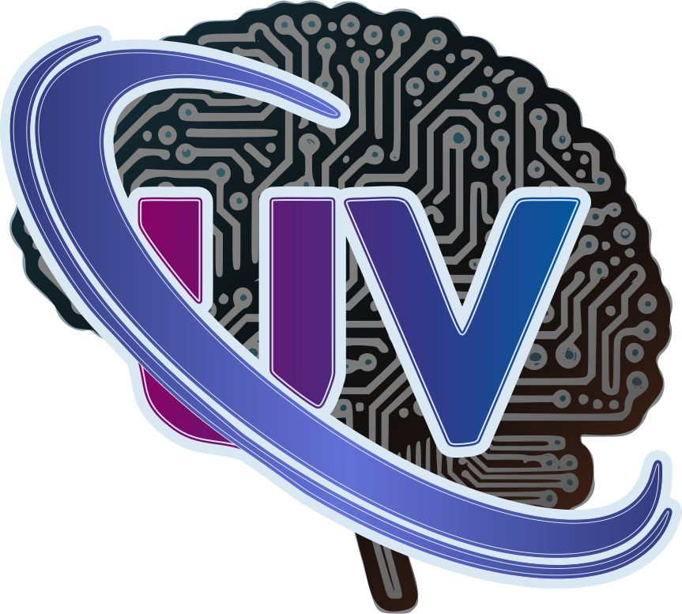
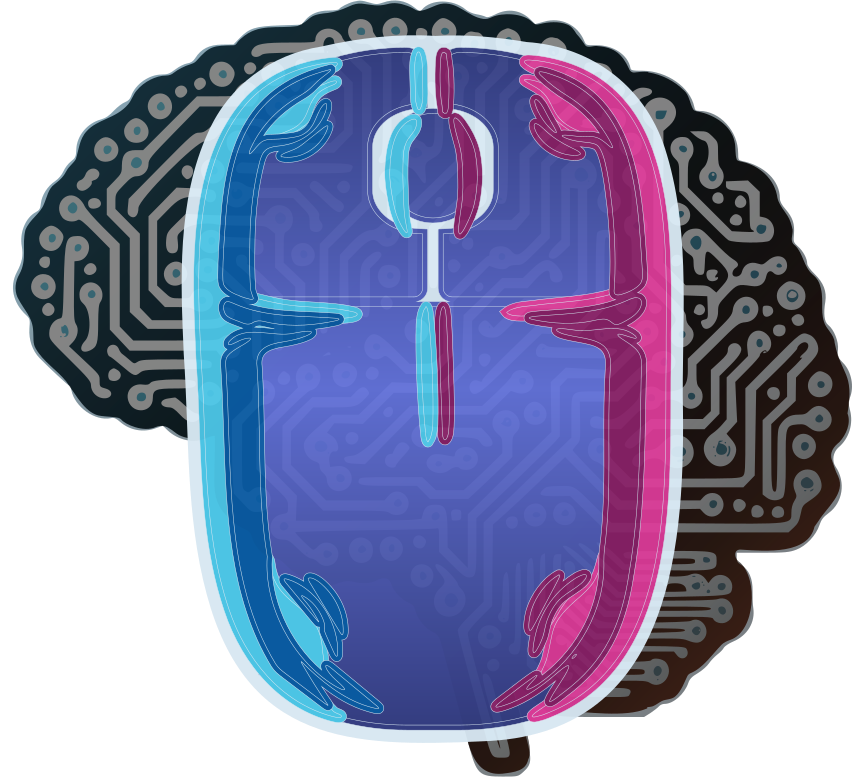
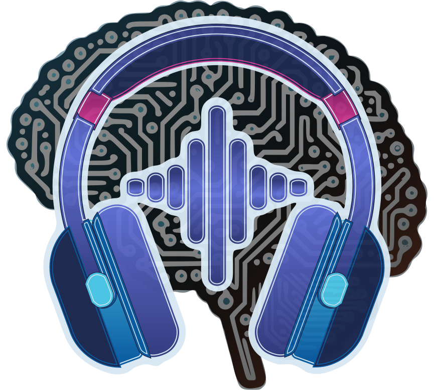
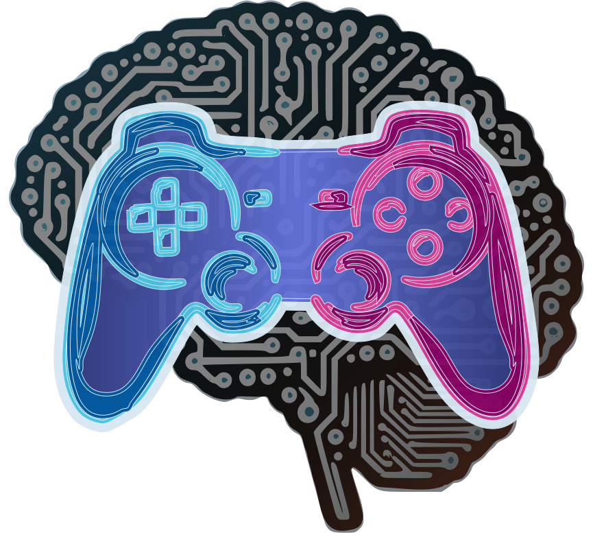
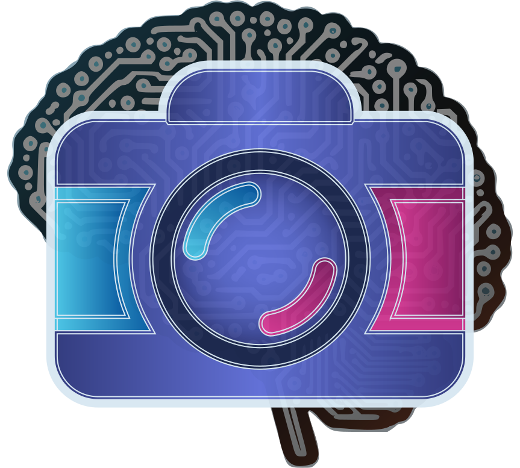
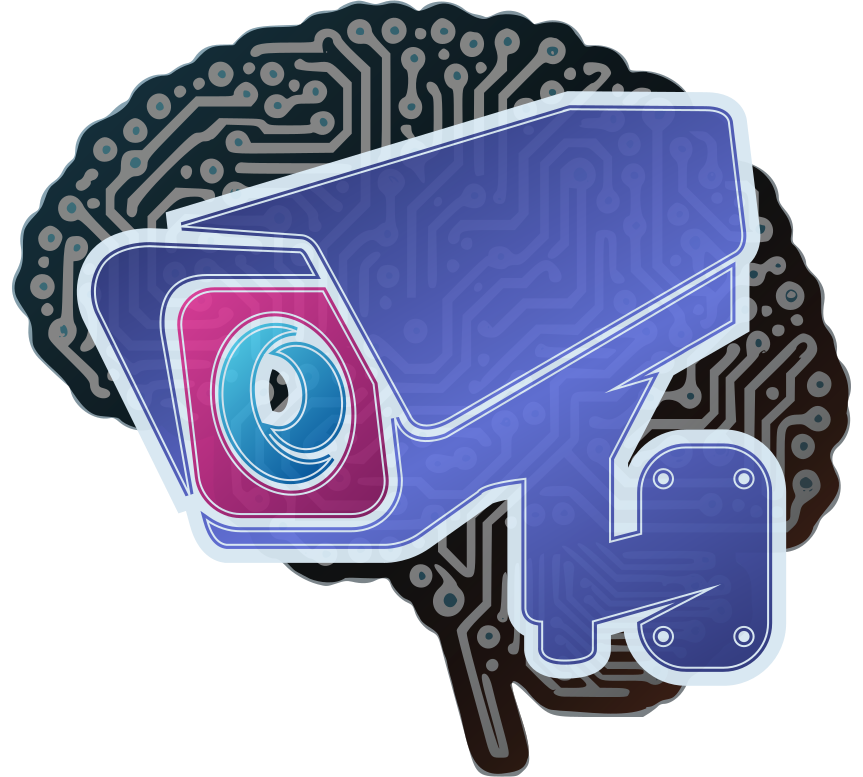
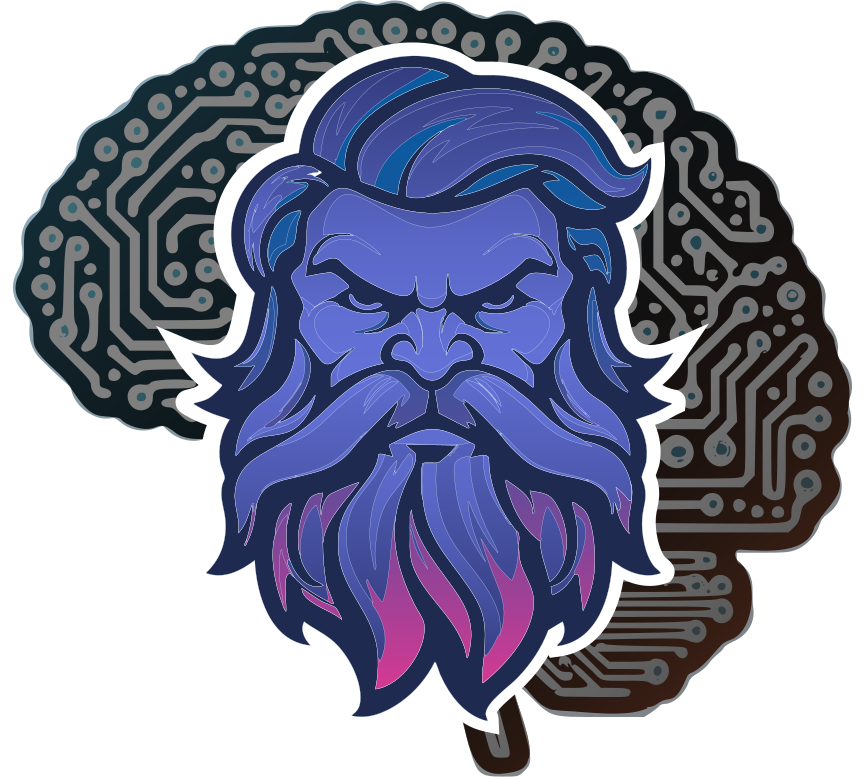
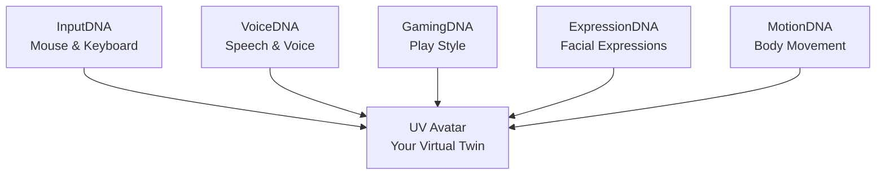
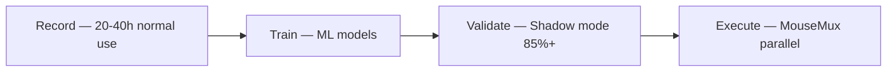

<p align="center">
  <picture>
    <source media="(prefers-color-scheme: dark)" srcset="support/logo/dark/UVirtual.svg">
    <source media="(prefers-color-scheme: light)" srcset="support/logo/light/UVirtual.svg">
    
  </picture>
</p>

# UVirtual

**UVirtual** (UV) is an AI platform that builds a complete virtual replica of YOU. It captures, learns, and reproduces your unique behavioral patterns across multiple domains — how you move the mouse, type on the keyboard, speak, play games, express emotions, and move your body. Each DNA module records a specific dimension of your behavior, and together they form a digital fingerprint so faithful it crosses the uncanny valley.

The end goal: a **UV Avatar** — a virtual character that IS you, assembled from all your DNA modules, usable in games, virtual worlds, and any environment that needs an authentic digital twin.

### DNA Modules

<table>
  <tr>
    <td align="center" width="160">
      <picture>
        <source media="(prefers-color-scheme: dark)" srcset="support/logo/dark/UV-InputDNA.svg">
        <source media="(prefers-color-scheme: light)" srcset="support/logo/light/UV-InputDNA.svg">
        
      </picture><br><b>InputDNA</b>
    </td>
    <td><b>Mouse &amp; Keyboard Behavior</b><br>Records how you move the mouse (path shapes, speed profiles, micro-jitter, click hesitation) and type on the keyboard (digraph timing, key hold duration, typing rhythm, shortcuts). Builds a personal input fingerprint from 20-40 hours of normal PC use.</td>
    <td width="80"><b>Active</b></td>
  </tr>
  <tr>
    <td align="center" width="160">
      <picture>
        <source media="(prefers-color-scheme: dark)" srcset="support/logo/dark/UV-VoiceDNA.svg">
        <source media="(prefers-color-scheme: light)" srcset="support/logo/light/UV-VoiceDNA.svg">
        
      </picture><br><b>VoiceDNA</b>
    </td>
    <td><b>Voice &amp; Speech Patterns</b><br>Learns your vocal identity — speech rhythm, pauses between words, intonation curves, tone variations, speaking tempo, and accent characteristics. Captures the way YOU speak, not just what you say. Requires microphone.</td>
    <td width="80">Planned</td>
  </tr>
  <tr>
    <td align="center" width="160">
      <picture>
        <source media="(prefers-color-scheme: dark)" srcset="support/logo/dark/UV-GamingDNA.svg">
        <source media="(prefers-color-scheme: light)" srcset="support/logo/light/UV-GamingDNA.svg">
        
      </picture><br><b>GamingDNA</b>
    </td>
    <td><b>Gaming Behavior &amp; Play Style</b><br>Records game-specific behavioral patterns — reaction times, decision-making speed, strategic choices, fear responses, aggression levels, risk tolerance, and overall play style. Each game gets its own profile because you play differently in an FPS vs. a strategy game.</td>
    <td width="80">Planned</td>
  </tr>
  <tr>
    <td align="center" width="160">
      <picture>
        <source media="(prefers-color-scheme: dark)" srcset="support/logo/dark/UV-ExpressionDNA.svg">
        <source media="(prefers-color-scheme: light)" srcset="support/logo/light/UV-ExpressionDNA.svg">
        
      </picture><br><b>ExpressionDNA</b>
    </td>
    <td><b>Facial Expressions &amp; Emotions</b><br>Captures your unique facial expressions for each emotional state — how YOU specifically smile, frown, show surprise, concentrate, or react. Maps the micro-movements and muscle patterns that make your expressions distinctly yours. Requires camera.</td>
    <td width="80">Planned</td>
  </tr>
  <tr>
    <td align="center" width="160">
      <picture>
        <source media="(prefers-color-scheme: dark)" srcset="support/logo/dark/UV-MotionDNA.svg">
        <source media="(prefers-color-scheme: light)" srcset="support/logo/light/UV-MotionDNA.svg">
        
      </picture><br><b>MotionDNA</b>
    </td>
    <td><b>Body Movement &amp; Gestures</b><br>Learns your physical movement patterns — posture, gait, hand gestures, head movements, and body language. Captures the way you move in 3D space, from subtle fidgeting to full-body motion. Requires multiple cameras.</td>
    <td width="80">Planned</td>
  </tr>
  <tr>
    <td align="center" width="160">
      <picture>
        <source media="(prefers-color-scheme: dark)" srcset="support/logo/dark/UV-Avatar.svg">
        <source media="(prefers-color-scheme: light)" srcset="support/logo/light/UV-Avatar.svg">
        
      </picture><br><b>UV Avatar</b>
    </td>
    <td><b>Your Virtual Twin</b><br>The culmination of all DNA modules. Like a character creator in a game, except instead of designing a fictional character, you build one that IS you — assembled from your InputDNA, VoiceDNA, GamingDNA, ExpressionDNA, and MotionDNA. Deploy your avatar as an NPC, a game character, or a digital twin in any virtual world.</td>
    <td width="80">Future</td>
  </tr>
</table>

### How It All Connects



---

<p align="center">
  <picture>
    <source media="(prefers-color-scheme: dark)" srcset="support/logo/dark/UV-InputDNA.svg">
    <source media="(prefers-color-scheme: light)" srcset="support/logo/light/UV-InputDNA.svg">
    
  </picture>
</p>

# InputDNA

A machine learning-based system for recording, learning, and replaying personalized human-like mouse and keyboard input patterns. The first and currently active DNA module in the UVirtual ecosystem.

## Overview

InputDNA creates a **personal input fingerprint** — capturing how YOU specifically move the mouse and type on the keyboard — then uses ML models to replay that behavior through MouseMux virtual devices. The result is automated input that is statistically indistinguishable from your real input.

### System Flow



### Key Features

| Feature | Description |
|---------|-------------|
| Mouse Recording | Path shapes, speed profiles, click behavior, micro-jitter |
| Keyboard Recording | Digraph timing, key hold duration, shortcuts, typing rhythm |
| ML Training | Personal models trained on YOUR recorded data |
| Validation | Shadow mode testing with similarity scoring |
| Replay Engine | MouseMux integration for parallel execution on 15+ Chrome windows |

---

<a id="table-of-contents"></a>

## Table of Contents

- [Project Structure](#project-structure)
- [Folder Documentation](#folder-documentation)
- [Specification Documents](#specification-documents)
- [Quick Start](#quick-start)
- [Building & Installation](#building--installation)
- [Requirements](#requirements)

---

<a id="project-structure"></a>

## Project Structure

```
📁 InputDNA/
  🐍 main.py                         Entry point, orchestrates everything
  ⚙️ config.py                        All settings, thresholds, paths
  📄 requirements.txt                 Dependencies
  📝 CLAUDE.md                        Claude Code instructions
  📝 implementation-plan.md           Full system design document
  📝 README.md                        This file
  📄 .gitignore
  📁 listeners/                       OS-level input hooks
    🐍 mouse_listener.py              pynput mouse hook → raw events
    🐍 keyboard_listener.py           pynput keyboard hook → raw events
  📁 processors/                      Event analysis & session building
    🐍 __init__.py                    EventProcessor (central dispatcher)
    🐍 mouse_session.py               Movement session detection
    🐍 click_processor.py             Click sequences (single/double/spam)
    🐍 drag_detector.py               Drag operation detection
    🐍 keyboard_processor.py          Keystroke timing, transitions, shortcuts
  📁 database/                        SQLite persistence layer
    🐍 schema.py                      All CREATE TABLE statements + pragmas
    🐍 writer.py                      Batched DB writer (single thread)
    🐍 rotation.py                    DB size rotation and archiving
  📁 models/                          Data classes (NOT ML models)
    🐍 events.py                      Raw event types from listeners
    🐍 sessions.py                    Processed records for DB
  📁 utils/                           Shared utilities
    🐍 timing.py                      perf_counter_ns wrappers
    🐍 keyboard_layout.py             Scan code → hand/finger map
    🐍 hotkeys.py                     Pause/resume hotkey (Ctrl+Alt+R)
    🐍 system_monitor.py              Mouse speed, resolution, layout tracking
  📁 ui/                              System tray interface
    🐍 tray_icon.py                   pystray: green/yellow/red status
    🖼️ InputDNA-start.png             Tray icon (recording)
    🖼️ InputDNA-pause.png             Tray icon (paused)
    🖼️ InputDNA-stop.png              Tray icon (stopped)
  📁 gui/                             PySide6 desktop application
    🐍 login_screen.py                User login/register
    🐍 main_dashboard.py              Record / Train / Validate controls
    🐍 validation_screen.py           Model accuracy testing
    🐍 settings_screen.py             Per-user GUI configuration
    🐍 calibration_dialog.py          Click speed calibration
    🐍 dpi_dialog.py                  DPI measurement dialog
    🐍 export_utils.py                Database export from dashboard
    🐍 user_db.py                     User profile database
    🐍 user_settings.py               Per-user settings persistence
    🐍 styles.py                      Dark theme QSS
  📁 setup/                           Build & installation scripts
    🐍 build.py                       PyInstaller + signing + NSIS packaging
    🐍 create_cert.py                 Self-signed code signing certificate
    📄 installer.nsi                  NSIS Windows installer script
    🖼️ InputDNA.ico                   Application icon
  📁 data/                            Runtime database (gitignored)
    📁 db/                            Per-user SQLite databases
    📁 logs/                          Log files
  📁 docs/                            Specification documents
    📝 01-mouse-movement-recorder.md
    📝 02-behavioral-adaptations.md
    📝 03-keyboard-input-recorder.md
    📝 04-validation-testing.md
    📝 05-ml-model-architecture.md
    📝 06-replay-engine.md
    📝 07-technical-conclusions.md
  📁 support/                         Design assets and branding
    📁 logo/                          SVG logos
    📁 adobe/                         Illustrator source files
```

> **Note:** Every folder contains a `__folder.md` doc with detailed documentation of its files,
> design decisions, and data flow diagrams.

---

<a id="folder-documentation"></a>

## Folder Documentation

Each module folder has its own documentation file (`__folder.md`):

| Folder | Documentation | Description |
|--------|---------------|-------------|
| `database/` | [`__database.md`](database/__database.md) | SQLite schema, batched writer, WAL mode |
| `listeners/` | [`__listeners.md`](listeners/__listeners.md) | Mouse & keyboard OS hooks, scan codes |
| `processors/` | [`__processors.md`](processors/__processors.md) | Session detection, click grouping, keyboard processing |
| `models/` | [`__models.md`](models/__models.md) | Raw events & processed records (dataclasses) |
| `utils/` | [`__utils.md`](utils/__utils.md) | Timing, keyboard layout, hotkeys |
| `ui/` | [`__ui.md`](ui/__ui.md) | System tray icon (pystray) |
| `gui/` | [`__gui.md`](gui/__gui.md) | PySide6 desktop GUI (login, dashboard, validation) |
| `data/` | [`__data.md`](data/__data.md) | Runtime database location |
| `setup/` | [`__setup.md`](setup/__setup.md) | Build pipeline and Windows installer |
| `support/` | [`__support.md`](support/__support.md) | Design assets and branding |

---

<a id="specification-documents"></a>

## Specification Documents

All in `docs/`:

| # | Document | Description |
|---|----------|-------------|
| 1 | [Mouse Movement Recorder](docs/01-mouse-movement-recorder.md) | Core recording spec, database schema, metrics |
| 2 | [Behavioral Adaptations](docs/02-behavioral-adaptations.md) | WHY we capture each behavioral pattern |
| 3 | [Keyboard Input Recorder](docs/03-keyboard-recorder.md) | Digraphs, shortcuts, typing modes |
| 4 | [Validation & Testing](docs/04-validation-testing.md) | Shadow mode, similarity scoring, 85%+ target |
| 5 | [ML Model Architecture](docs/05-ml-model-architecture.md) | Ensemble models, training pipeline |
| 6 | [Replay Engine](docs/06-replay-engine.md) | MouseMux integration, precision timing |
| 7 | [Technical Conclusions](docs/07-technical-conclusions.md) | Anti-detection analysis, polling rates |

<details>
<summary>Document details (click to expand)</summary>

### 1. Mouse Movement Recorder

Core specification for the background Python application that records mouse movements.
Covers: session detection, SQLite schema, derived metrics, polling rate detection.

### 2. Behavioral Adaptations

Deep dive into WHY we capture each behavioral pattern and how bots fail to replicate them.
Covers: pre-click hesitation, overshoot, micro-jitter, fatigue, directional bias.

### 3. Keyboard Input Recorder

Specification for capturing personal keyboard input patterns.
Covers: typing modes, digraph timing, key hold duration, shortcut timing, burst rhythm.

### 4. Validation & Testing

Framework for testing ML model accuracy.
Covers: shadow mode architecture, Frechet distance, speed correlation, composite scoring.

### 5. ML Model Architecture

ML architecture for generating personalized input.
Covers: VAE/LSTM/KNN path generators, speed profiler, overshoot predictor, digraph model.

### 6. Replay Engine

Execution layer through MouseMux.
Covers: WebSocket protocol, spin-wait timing, virtual key codes, parallel workers.

### 7. Technical Conclusions

Key insights on detectability and implementation.
Covers: localhost WebSocket, claim mechanism, polling rate matching, anti-bot analysis.

</details>

---

<a id="quick-start"></a>

## Quick Start

### Phase 1: Recording (20-40 hours of normal use)
```bash
python main.py
# Use your computer normally — mouse and keyboard data is captured
# Ctrl+Alt+R to pause/resume, system tray icon shows status
```

### Phase 2: Training
```bash
# Future — ML training pipeline not yet implemented
```

### Phase 3: Validation
```bash
# Future — shadow mode validation not yet implemented
```

### Phase 4: Production
```bash
# Future — MouseMux replay engine not yet implemented
```

---

<a id="building--installation"></a>

## Building & Installation

InputDNA can be packaged as a standalone Windows application with a classic installer.

### Prerequisites

| Tool | Purpose | Install |
|------|---------|---------|
| PyInstaller | Bundle Python into exe | `pip install pyinstaller` |
| NSIS | Create Windows installer | [nsis.sourceforge.io](https://nsis.sourceforge.io/) |
| Windows SDK | Code signing (optional) | [developer.microsoft.com](https://developer.microsoft.com/en-us/windows/downloads/windows-sdk/) |

### Build Steps

```bash
# 1. One-time: generate self-signed code signing certificate
python setup/create_cert.py

# 2. Build exe + create installer
python setup/build.py

# Output: dist/InputDNA_Setup.exe
```

### What the Installer Does

1. **Choose install location** — default `C:\Program Files\InputDNA\`
2. **Copy program files** — exe + runtime dependencies
3. **Create data directories** — `%LOCALAPPDATA%\InputDNA\db\` and `logs\`
4. **Add Windows Defender exclusions** — prevents false positives from input hooks
5. **Create shortcuts** — Start Menu + optional Desktop
6. **Optional autostart** — launch InputDNA with Windows
7. **Register in Add/Remove Programs** — standard uninstall support

### Installed File Layout

```
📁 C:\Program Files\InputDNA\           ← Program files
  📄 InputDNA.exe
  🖼️ InputDNA.ico
  📄 (PyInstaller runtime files)

📁 %LOCALAPPDATA%\InputDNA\             ← User data (preserved on uninstall)
  📁 db\
    🗄️ profiles.db                      ← User profiles
    📁 user_1\
      🗄️ movements.db                   ← Per-user recordings
  📁 logs\
```

> **Note:** Uninstalling removes program files but preserves user data in AppData.

---

<a id="requirements"></a>

## Requirements

- Python 3.10+
- Windows 11 (pynput + ctypes for scan code extraction)

**Dependencies** (`requirements.txt`):

| Package | Version | Purpose |
|---------|---------|---------|
| `pynput` | >=1.7.6 | Mouse & keyboard hooks |
| `pystray` | >=0.19.5 | System tray icon |
| `Pillow` | >=10.0 | Required by pystray |
| `PySide6` | >=6.5 | Desktop GUI (login, dashboard, settings) |

> **Note:** No numpy, no pywin32. Distance and math use `math.sqrt`, `math.atan2` from stdlib.

---

## License

Private project.
