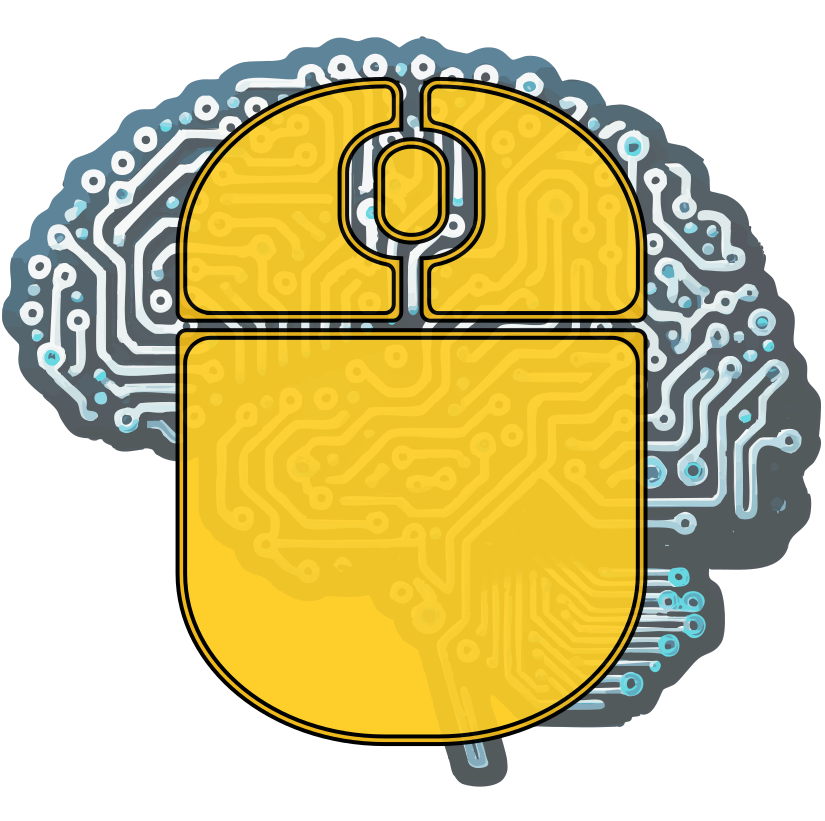
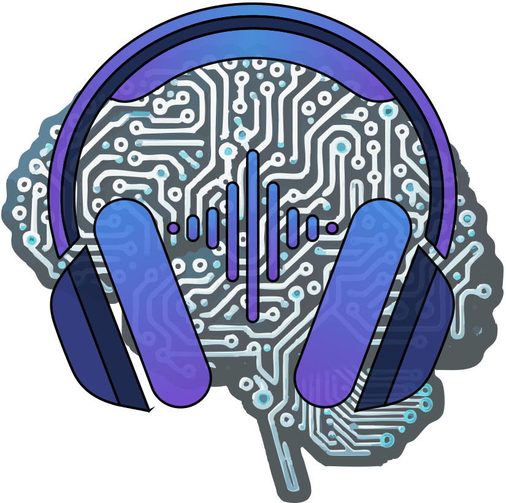
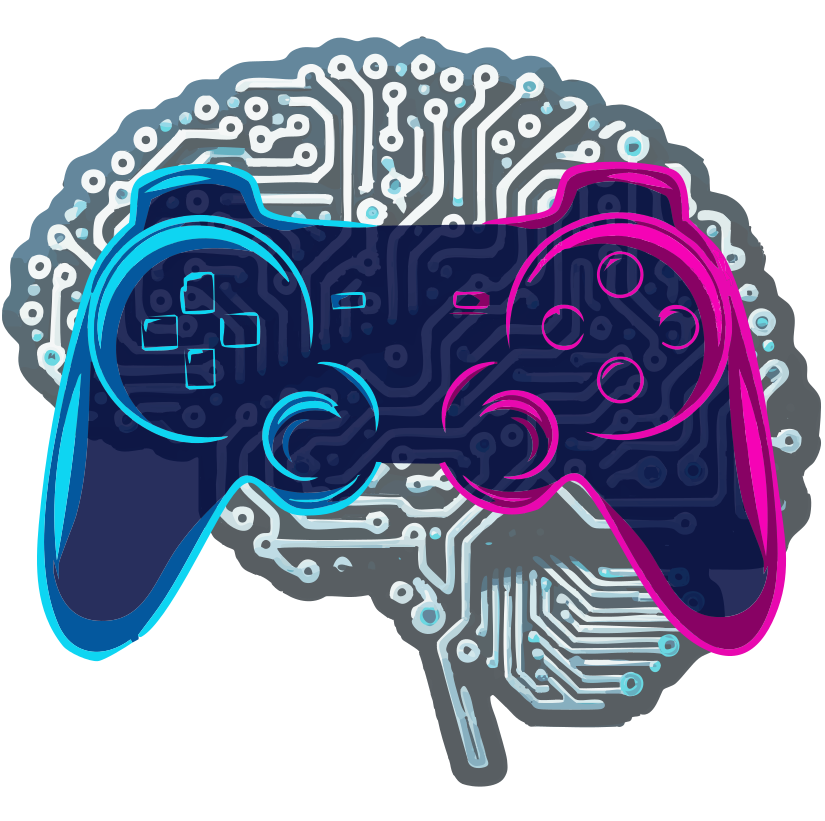
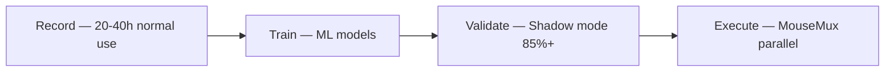

<p align="center">
  
</p>

# Uncanny Valley

**Uncanny Valley** is a suite of AI projects that learn and replicate individual human behavior across different domains — input, speech, gaming, and more. Each sub-project builds a personal behavioral model so faithful that the output crosses the uncanny valley, becoming indistinguishable from the real person.

### Sub-Projects

<table>
  <tr>
    <td align="center" width="200"><br><b>InputDNA</b></td>
    <td>Mouse movement, keyboard typing, click behavior</td>
    <td><b>Active</b></td>
  </tr>
  <tr>
    <td align="center" width="200"><br><b>VoiceDNA</b></td>
    <td>Voice patterns, speech rhythm, intonation</td>
    <td>Planned</td>
  </tr>
  <tr>
    <td align="center" width="200"><br><b>GamingDNA</b></td>
    <td>Gaming input patterns, reaction times, strategies</td>
    <td>Planned</td>
  </tr>
</table>

---

<p align="center">
  
</p>

# InputDNA

A machine learning-based system for recording, learning, and replaying personalized human-like mouse and keyboard input patterns.

## Overview

InputDNA creates a **personal input fingerprint** — capturing how YOU specifically move the mouse and type on the keyboard — then uses ML models to replay that behavior through MouseMux virtual devices. The result is automated input that is statistically indistinguishable from your real input.

### System Flow



### Key Features

| Feature | Description |
|---------|-------------|
| Mouse Recording | Path shapes, speed profiles, click behavior, micro-jitter |
| Keyboard Recording | Digraph timing, key hold duration, shortcuts, typing rhythm |
| ML Training | Personal models trained on YOUR recorded data |
| Validation | Shadow mode testing with similarity scoring |
| Replay Engine | MouseMux integration for parallel execution on 15+ Chrome windows |

---

<a id="table-of-contents"></a>

## Table of Contents

- [Project Structure](#project-structure)
- [Folder Documentation](#folder-documentation)
- [Specification Documents](#specification-documents)
- [Quick Start](#quick-start)
- [Requirements](#requirements)

---

<a id="project-structure"></a>

## Project Structure

```
InputDNA/
  main.py                     Entry point, orchestrates everything
  config.py                   All settings, thresholds, paths
  requirements.txt            Dependencies
  CLAUDE.md                   Claude Code instructions
  implementation-plan.md      Full system design document
  README.md                   This file
  .gitignore
  listeners/                  OS-level input hooks
    mouse_listener.py         pynput mouse hook -> raw events
    keyboard_listener.py      pynput keyboard hook -> raw events
  processors/                 Event analysis & session building
    __init__.py               EventProcessor (central dispatcher)
    mouse_session.py          Movement session detection
    click_processor.py        Click sequences (single/double/spam)
    drag_detector.py          Drag operation detection
    keyboard_processor.py     Keystroke timing, transitions, shortcuts
  database/                   SQLite persistence layer
    schema.py                 All CREATE TABLE statements + pragmas
    writer.py                 Batched DB writer (single thread)
  models/                     Data classes (NOT ML models)
    events.py                 Raw event types from listeners
    sessions.py               Processed records for DB
  utils/                      Shared utilities
    timing.py                 perf_counter_ns wrappers
    keyboard_layout.py        Scan code -> hand/finger map
    hotkeys.py                Pause/resume hotkey (Ctrl+Alt+R)
  ui/                         System tray interface
    tray_icon.py              pystray: green/yellow/red status
  gui/                        PySide6 desktop application
    login_screen.py           User login/register
    main_dashboard.py         Record / Train / Validate controls
    validation_screen.py      Model accuracy testing
    styles.py                 Dark theme QSS
    user_db.py                User profile database
  data/                       Runtime database (gitignored)
    movements.db              Created at runtime
  docs/                       Specification documents
    01-mouse-movement-recorder.md
    02-behavioral-adaptations.md
    03-keyboard-input-recorder.md
    04-validation-testing.md
    05-ml-model-architecture.md
    06-replay-engine.md
    07-technical-conclusions.md
```

> **Note:** Every folder contains a `__folder.md` doc with detailed documentation of its files,
> design decisions, and data flow diagrams.

---

<a id="folder-documentation"></a>

## Folder Documentation

Each module folder has its own documentation file (`__folder.md`):

| Folder | Documentation | Description |
|--------|---------------|-------------|
| `database/` | [`__database.md`](database/__database.md) | SQLite schema, batched writer, WAL mode |
| `listeners/` | [`__listeners.md`](listeners/__listeners.md) | Mouse & keyboard OS hooks, scan codes |
| `processors/` | [`__processors.md`](processors/__processors.md) | Session detection, click grouping, keyboard processing |
| `models/` | [`__models.md`](models/__models.md) | Raw events & processed records (dataclasses) |
| `utils/` | [`__utils.md`](utils/__utils.md) | Timing, keyboard layout, hotkeys |
| `ui/` | [`__ui.md`](ui/__ui.md) | System tray icon (pystray) |
| `gui/` | [`__gui.md`](gui/__gui.md) | PySide6 desktop GUI (login, dashboard, validation) |
| `data/` | [`__data.md`](data/__data.md) | Runtime database location |
| `support/` | [`__support.md`](support/__support.md) | Design assets and branding |

---

<a id="specification-documents"></a>

## Specification Documents

All in `docs/`:

| # | Document | Description |
|---|----------|-------------|
| 1 | [Mouse Movement Recorder](docs/01-mouse-movement-recorder.md) | Core recording spec, database schema, metrics |
| 2 | [Behavioral Adaptations](docs/02-behavioral-adaptations.md) | WHY we capture each behavioral pattern |
| 3 | [Keyboard Input Recorder](docs/03-keyboard-recorder.md) | Digraphs, shortcuts, typing modes |
| 4 | [Validation & Testing](docs/04-validation-testing.md) | Shadow mode, similarity scoring, 85%+ target |
| 5 | [ML Model Architecture](docs/05-ml-model-architecture.md) | Ensemble models, training pipeline |
| 6 | [Replay Engine](docs/06-replay-engine.md) | MouseMux integration, precision timing |
| 7 | [Technical Conclusions](docs/07-technical-conclusions.md) | Anti-detection analysis, polling rates |

<details>
<summary>Document details (click to expand)</summary>

### 1. Mouse Movement Recorder

Core specification for the background Python application that records mouse movements.
Covers: session detection, SQLite schema, derived metrics, polling rate detection.

### 2. Behavioral Adaptations

Deep dive into WHY we capture each behavioral pattern and how bots fail to replicate them.
Covers: pre-click hesitation, overshoot, micro-jitter, fatigue, directional bias.

### 3. Keyboard Input Recorder

Specification for capturing personal keyboard input patterns.
Covers: typing modes, digraph timing, key hold duration, shortcut timing, burst rhythm.

### 4. Validation & Testing

Framework for testing ML model accuracy.
Covers: shadow mode architecture, Frechet distance, speed correlation, composite scoring.

### 5. ML Model Architecture

ML architecture for generating personalized input.
Covers: VAE/LSTM/KNN path generators, speed profiler, overshoot predictor, digraph model.

### 6. Replay Engine

Execution layer through MouseMux.
Covers: WebSocket protocol, spin-wait timing, virtual key codes, parallel workers.

### 7. Technical Conclusions

Key insights on detectability and implementation.
Covers: localhost WebSocket, claim mechanism, polling rate matching, anti-bot analysis.

</details>

---

<a id="quick-start"></a>

## Quick Start

### Phase 1: Recording (20-40 hours of normal use)
```bash
python main.py
# Use your computer normally — mouse and keyboard data is captured
# Ctrl+Alt+R to pause/resume, system tray icon shows status
```

### Phase 2: Training
```bash
# Future — ML training pipeline not yet implemented
```

### Phase 3: Validation
```bash
# Future — shadow mode validation not yet implemented
```

### Phase 4: Production
```bash
# Future — MouseMux replay engine not yet implemented
```

---

<a id="requirements"></a>

## Requirements

- Python 3.10+
- Windows 11 (pynput + ctypes for scan code extraction)

**Dependencies** (`requirements.txt`):

| Package | Version | Purpose |
|---------|---------|---------|
| `pynput` | >=1.7.6 | Mouse & keyboard hooks |
| `pystray` | >=0.19.5 | System tray icon |
| `Pillow` | >=10.0 | Required by pystray |

> **Note:** No numpy, no pywin32. Pure standard library + 3 packages.
> Distance and math: `math.sqrt`, `math.atan2` from stdlib.

---

## License

Private project.
