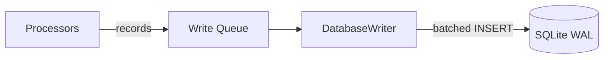

# database/

SQLite database layer. Handles schema creation and batched writing.

<a id="folder-structure"></a>

## Folder Structure

```
📁 database/
  📝 README.md
  🐍 __init__.py
  🐍 schema.py
  🐍 writer.py
```

<a id="files"></a>

## Files

### `schema.py` — Table Definitions

Creates all tables on first run. Sets SQLite pragmas for performance
(WAL mode, memory-mapped I/O, etc.). Safe to call multiple times —
uses `IF NOT EXISTS`.

**Tables created:**

| Table | Category | Description |
|-------|----------|-------------|
| `movements` | Mouse | Movement sessions (start→end with summary metrics) |
| `path_points` | Mouse | Raw (x, y, t_ns) coordinates within movements |
| `click_sequences` | Mouse | Unified click tracking (single/double/spam) |
| `click_details` | Mouse | Individual clicks within sequences |
| `drags` | Mouse | Click-hold-move-release operations |
| `drag_points` | Mouse | Path coordinates during drags |
| `scrolls` | Mouse | Scroll wheel events |
| `keystrokes` | Keyboard | Individual key presses with scan codes |
| `key_transitions` | Keyboard | Delay between consecutive keys (scan code pairs) |
| `shortcuts` | Keyboard | Keyboard shortcut timing profiles |
| `recording_sessions` | Meta | Recording periods (start/end/counts) |
| `metadata` | Meta | Key-value config/stats |

**SQLite pragmas applied:**

```sql
PRAGMA journal_mode=WAL;
PRAGMA synchronous=NORMAL;
PRAGMA cache_size=-64000;
PRAGMA temp_store=MEMORY;
PRAGMA mmap_size=268435456;
```

### `writer.py` — Batched Database Writer

Single-threaded writer that consumes records from a queue and writes them
in batches for performance. All database writes go through this one writer —
no concurrent write issues.

**Batching strategy:**

| Parameter | Default | Description |
|-----------|---------|-------------|
| `BATCH_SIZE` | 100 | Max records per flush |
| `FLUSH_INTERVAL` | 2.0s | Max time between flushes |

Whichever threshold is hit first triggers a flush. Each flush is a single
transaction. Final flush on shutdown ensures no data loss.

<a id="data-flow"></a>

## Data Flow



> **Note:** The write queue is a standard `queue.Queue` — thread-safe, no locks needed by callers.

<a id="design-decisions"></a>

## Design Decisions

| Decision | Rationale |
|----------|-----------|
| WAL mode | Allows reading while writing (for future stats UI) |
| Single writer | Eliminates all concurrency issues with SQLite |
| `perf_counter_ns` in `t_ns` columns | Maximum precision timestamps (integer nanoseconds) |
| Wall clock in `timestamp` columns | Human readability only — never used for calculations |
| No indexes by default | Added later during ML prep phase if needed (INSERT-heavy workload) |
