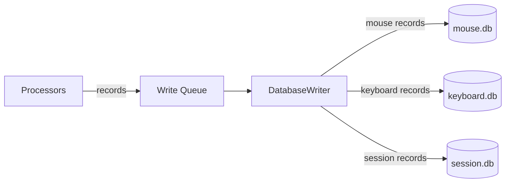

# database/

SQLite database layer. Handles schema creation and batched writing.

<a id="folder-structure"></a>

## Folder Structure

```
📁 database/
  📝 __database.md
  🐍 __init__.py
  🐍 schema.py
  🐍 writer.py
  🐍 rotation.py
```

<a id="files"></a>

## Files

### `schema.py` — Table Definitions (3 Databases)

Creates all tables on first run. Sets SQLite pragmas for performance
(WAL mode, memory-mapped I/O, etc.). Safe to call multiple times —
uses `IF NOT EXISTS`.

Each user has **three separate databases**:

| Database | Init Function | Tables |
|----------|---------------|--------|
| `mouse.db` | `init_mouse_db()` | movements, path_points, click_sequences, click_details, drags, drag_points, scrolls, metadata |
| `keyboard.db` | `init_keyboard_db()` | keystrokes, key_transitions, shortcuts |
| `session.db` | `init_session_db()` | recording_sessions, system_events, metadata |

**Mouse tables:**

| Table | Description |
|-------|-------------|
| `movements` | Movement sessions with `start_t_ns`/`end_t_ns` bookends |
| `path_points` | Delta-encoded path: seq=0 absolute (x,y), seq>0 (Δx,Δy,dt_us) |
| `click_sequences` | Unified click tracking (single/double/spam) |
| `click_details` | Individual clicks within sequences, incl. press `(x, y)` |
| `drags` | Click-hold-move-release operations |
| `drag_points` | Path coordinates during drags |
| `scrolls` | Scroll wheel events |
| `metadata` | Key-value store (path_encoding, etc.) |

**Keyboard tables:**

| Table | Description |
|-------|-------------|
| `keystrokes` | Individual key presses: scan code, press duration, modifier bitmask |
| `key_transitions` | Delay between consecutive keys (scan code pairs); `is_repeat` flags OS auto-repeat |
| `shortcuts` | Keyboard shortcut timing profiles |

**Session tables:**

| Table | Description |
|-------|-------------|
| `recording_sessions` | Recording periods (start/end/counts) |
| `system_events` | Tracks changes to system state (mouse speed, layout, resolution, etc.) |
| `metadata` | Key-value store for session-level config/stats |

**Key schema details:**

- `movements.id` and `drags.id` are **app-generated** (not AUTOINCREMENT): format `session_id × 1_000_000 + seq_within_session`. This encodes the session directly (no separate `recording_session_id` FK needed) and allows the processor to know the ID before DB write.
- `path_points`, `drag_points`, and `click_details` are **`WITHOUT ROWID`** tables with composite primary keys: `(movement_id, seq)`, `(drag_id, seq)`, `(sequence_id, seq)`. No hidden rowid — data stored directly in the PK B-tree. Eliminates the duplicate B-tree that a regular composite PK would create.
- **Delta encoding:** `seq=0` stores absolute `(x, y)`, `dt_us=0`. `seq>0` stores `(Δx, Δy)` and `dt_us` (microseconds since previous point). **Timing reconstruction:** `t_ns[0] = start_t_ns`, `t_ns[i] = t_ns[i-1] + dt_us[i] × 1000`. Metadata key `path_encoding=delta_v3` in mouse.db signals this schema to readers.
- `keystrokes.modifier_state` is stored as an **INTEGER bitmask** (bit 0=Ctrl, bit 1=Alt, bit 2=Shift, bit 3=Win), not a JSON string.
- `click_details` uses composite primary key `(sequence_id, seq)` — no separate `id` column. Columns `x, y` hold the press (button-down) position; they are `NULL` for rows written before click coordinates were captured (legacy data).
- `key_transitions.is_repeat` = `1` for OS auto-repeat runs (a held key firing `from_scan == to_scan` rows at the hardware repeat rate), `0` for genuine consecutive presses. Repeats are excluded from digraph/flight-time stats and kept only as a hold-to-repeat signal.
- `scrolls` stores `dx, dy` (signed per-axis amount) so horizontal and vertical scrolls stay distinguishable. The legacy `delta` column (`= dy if dy != 0 else dx`) is retained so existing readers keep working.
- **Session attribution:** `keystrokes`, `key_transitions`, `shortcuts`, `scrolls`, and `click_sequences` carry a `recording_session_id` column (stamped by `EventProcessor`). `movements` and `drags` don't need it — their app-generated id already encodes the session (`id ÷ 1_000_000`). `recording_sessions` also has `perf_counter_end_ns`, giving a monotonic session boundary even when `ended_at` (wall clock) is NULL after a crash.
- **Schema evolution:** columns added after the initial `delta_v3` release (`click_details.x/y`, `key_transitions.is_repeat`, the `recording_session_id` columns, `scrolls.dx/dy`, `recording_sessions.perf_counter_end_ns`) are backfilled into existing databases by `_ensure_columns()` (idempotent `ALTER TABLE ADD COLUMN`), run inside the `init_*` functions. `CREATE TABLE IF NOT EXISTS` alone never alters an existing table, so this keeps old databases usable without a full migration.

> **Schema version:** `path_encoding=delta_v3` in mouse.db metadata table. `delta_v1` = old schema (absolute `t_ns` per point, auto-increment `id`). `delta_v3` = current (delta `dt_us`, composite PK, WITHOUT ROWID). Post-processing must check this key before reading path data.

**SQLite pragmas applied (all three databases):**

```sql
PRAGMA journal_mode=WAL;
PRAGMA synchronous=NORMAL;
PRAGMA cache_size=-64000;
PRAGMA temp_store=MEMORY;
PRAGMA mmap_size=268435456;
```

### `writer.py` — Batched Database Writer

Single-threaded writer that consumes records from a queue and writes them
in batches for performance. Routes each record to the correct database
based on its `_db_target` class attribute.

All database writes go through this one writer — no concurrent write issues.
The writer re-applies the performance pragmas (`apply_pragmas`) on its own
connections — pragmas like `synchronous=NORMAL` are per-connection, so without
this the hot write path would silently fall back to SQLite defaults.

**Flush failure handling (fail-loud):** a batch is written per target DB in one
transaction. If that fails, the writer falls back to writing that group's
records **one at a time**, so a single poisoned record is isolated and dropped
(counted in `total_failed`, logged at ERROR) instead of discarding the whole
batch of up to `BATCH_SIZE` records. This replaces the old silent drop.

**Record routing:**

| `_db_target` value | Database |
|--------------------|----------|
| `"mouse"` | mouse.db |
| `"keyboard"` | keyboard.db |
| `"session"` | session.db |

**Batching strategy:**

| Parameter | Default | Description |
|-----------|---------|-------------|
| `BATCH_SIZE` | 100 | Max records per flush |
| `FLUSH_INTERVAL` | 2.0s | Max time between flushes |

Whichever threshold is hit first triggers a flush. Each flush groups records
by target database and commits each group in its own transaction.
Final flush on shutdown ensures no data loss.

### `rotation.py` — DB File Rotation

Archives an active DB when it exceeds `DB_ROTATION_MAX_BYTES` (default 5 GB).
Called once at session start for each of the three databases. If rotation triggers:

1. Active DB renamed with timestamp suffix (e.g., `mouse_20260211_143022.db`)
2. WAL and SHM files also renamed
3. Old DB VACUUMed in a background daemon thread
4. Fresh DB created at the original path

ML/post-processing discovers all DB files via `glob("*.db")` in the user folder.

<a id="data-flow"></a>

## Data Flow



> **Note:** The write queue is a standard `queue.Queue` — thread-safe, no locks needed by callers. The writer inspects each record's `_db_target` attribute to route it to the correct database connection.

<a id="design-decisions"></a>

## Design Decisions

| Decision | Rationale |
|----------|-----------|
| Three databases per user | Separation of concerns: mouse, keyboard, session data are independent |
| WAL mode | Allows reading while writing (for future stats UI) |
| Single writer | Eliminates all concurrency issues with SQLite |
| `_db_target` routing | Each record class declares its target DB — writer routes automatically |
| `perf_counter_ns` in `t_ns` columns | Maximum precision timestamps (integer nanoseconds) |
| Wall clock in `timestamp` columns | Human readability only — never used for calculations |
| No indexes by default | Added later during ML prep phase if needed (INSERT-heavy workload) |
| Delta-encoded paths | Smaller integers → fewer bytes in SQLite varint encoding (~30% savings) |
| App-generated movement and drag IDs | Format `session_id × 1_000_000 + seq` — encodes session, processor knows ID before write, links clicks/scrolls/drags immediately |
| `WITHOUT ROWID` on path/drag/click_details | Composite PK without WITHOUT ROWID creates two B-trees (hidden rowid + PK index), doubling storage. WITHOUT ROWID stores data directly in one PK B-tree. Result: ~25% smaller mouse.db |
| `dt_us` per path point, not `t_ns` | WH_MOUSE_LL fires only on pixel change — slow movements have non-uniform timing. `dt_us` (~2 bytes) preserves the actual velocity profile; absolute `t_ns` (~8 bytes) would be larger and uniform start/end interpolation destroys acceleration/deceleration |
| `modifier_state` as bitmask | 4 boolean flags stored as `INTEGER` (1 byte) vs JSON string (~62 bytes) — 62× smaller per keystroke |
| Derivable columns removed | `key_name`, `hand`, `finger`, `delay_ms`, `direction`, computed stats — all derivable in post-processing from scan codes and timestamps |

> **Full optimization rationale:** [docs/08-schema-optimization.md](../docs/08-schema-optimization.md)
