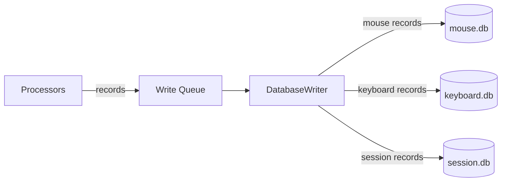

# database/

SQLite database layer. Handles schema creation and batched writing.

<a id="folder-structure"></a>

## Folder Structure

```
📁 database/
  📝 __database.md
  🐍 __init__.py
  🐍 schema.py
  🐍 writer.py
  🐍 rotation.py
```

<a id="files"></a>

## Files

### `schema.py` — Table Definitions (3 Databases)

Creates all tables on first run. Sets SQLite pragmas for performance
(WAL mode, memory-mapped I/O, etc.). Safe to call multiple times —
uses `IF NOT EXISTS`.

Each user has **three separate databases**:

| Database | Init Function | Tables |
|----------|---------------|--------|
| `mouse.db` | `init_mouse_db()` | movements, path_points, click_sequences, click_details, drags, drag_points, scrolls, metadata |
| `keyboard.db` | `init_keyboard_db()` | keystrokes, key_transitions, shortcuts |
| `session.db` | `init_session_db()` | recording_sessions, system_events, metadata |

**Mouse tables:**

| Table | Description |
|-------|-------------|
| `movements` | Movement sessions (start→end with summary metrics) |
| `path_points` | Raw (x, y, t_ns) coordinates within movements |
| `click_sequences` | Unified click tracking (single/double/spam) |
| `click_details` | Individual clicks within sequences |
| `drags` | Click-hold-move-release operations |
| `drag_points` | Path coordinates during drags |
| `scrolls` | Scroll wheel events |
| `metadata` | Key-value store (path_encoding, etc.) |

**Keyboard tables:**

| Table | Description |
|-------|-------------|
| `keystrokes` | Individual key presses with scan codes, vkey, and layout |
| `key_transitions` | Delay between consecutive keys (scan code pairs) |
| `shortcuts` | Keyboard shortcut timing profiles |

**Session tables:**

| Table | Description |
|-------|-------------|
| `recording_sessions` | Recording periods (start/end/counts) |
| `system_events` | Tracks changes to system state (mouse speed, layout, resolution, etc.) |
| `metadata` | Key-value store for session-level config/stats |

**Key schema details:**

- `movements.id` and `drags.id` are **app-generated** (not AUTOINCREMENT): format `session_id × 1_000_000 + seq_within_session`. This encodes the session directly (no separate `recording_session_id` FK needed) and allows the processor to know the ID before DB write.
- `path_points` and `drag_points` use **delta encoding** with **composite primary keys**: `(movement_id, seq)` and `(drag_id, seq)` — no separate `id` column. `seq=0` stores absolute `(x, y)`, `seq>0` stores deltas. Metadata key `path_encoding=delta_v2` in mouse.db signals the new schema to readers.
- `path_points` and `drag_points` do **not store `t_ns`** — timing is reconstructed in post-processing from `movements.start_t_ns`, `movements.end_t_ns`, and point count. See [docs/08-schema-optimization.md](../docs/08-schema-optimization.md) for the reconstruction formula.
- `keystrokes.modifier_state` is stored as an **INTEGER bitmask** (bit 0=Ctrl, bit 1=Alt, bit 2=Shift, bit 3=Win), not a JSON string.
- `click_details` uses composite primary key `(sequence_id, seq)` — no separate `id` column.

> **Schema version:** `path_encoding=delta_v2` in mouse.db metadata table. Old databases use `delta_v1` (with `t_ns` per point and `id` columns). Post-processing must check this key before reading path data.

**SQLite pragmas applied (all three databases):**

```sql
PRAGMA journal_mode=WAL;
PRAGMA synchronous=NORMAL;
PRAGMA cache_size=-64000;
PRAGMA temp_store=MEMORY;
PRAGMA mmap_size=268435456;
```

### `writer.py` — Batched Database Writer

Single-threaded writer that consumes records from a queue and writes them
in batches for performance. Routes each record to the correct database
based on its `_db_target` class attribute.

All database writes go through this one writer — no concurrent write issues.

**Record routing:**

| `_db_target` value | Database |
|--------------------|----------|
| `"mouse"` | mouse.db |
| `"keyboard"` | keyboard.db |
| `"session"` | session.db |

**Batching strategy:**

| Parameter | Default | Description |
|-----------|---------|-------------|
| `BATCH_SIZE` | 100 | Max records per flush |
| `FLUSH_INTERVAL` | 2.0s | Max time between flushes |

Whichever threshold is hit first triggers a flush. Each flush groups records
by target database and commits each group in its own transaction.
Final flush on shutdown ensures no data loss.

### `rotation.py` — DB File Rotation

Archives an active DB when it exceeds `DB_ROTATION_MAX_BYTES` (default 5 GB).
Called once at session start for each of the three databases. If rotation triggers:

1. Active DB renamed with timestamp suffix (e.g., `mouse_20260211_143022.db`)
2. WAL and SHM files also renamed
3. Old DB VACUUMed in a background daemon thread
4. Fresh DB created at the original path

ML/post-processing discovers all DB files via `glob("*.db")` in the user folder.

<a id="data-flow"></a>

## Data Flow



> **Note:** The write queue is a standard `queue.Queue` — thread-safe, no locks needed by callers. The writer inspects each record's `_db_target` attribute to route it to the correct database connection.

<a id="design-decisions"></a>

## Design Decisions

| Decision | Rationale |
|----------|-----------|
| Three databases per user | Separation of concerns: mouse, keyboard, session data are independent |
| WAL mode | Allows reading while writing (for future stats UI) |
| Single writer | Eliminates all concurrency issues with SQLite |
| `_db_target` routing | Each record class declares its target DB — writer routes automatically |
| `perf_counter_ns` in `t_ns` columns | Maximum precision timestamps (integer nanoseconds) |
| Wall clock in `timestamp` columns | Human readability only — never used for calculations |
| No indexes by default | Added later during ML prep phase if needed (INSERT-heavy workload) |
| Delta-encoded paths | Smaller integers → fewer bytes in SQLite varint encoding (~30% savings) |
| App-generated movement and drag IDs | Format `session_id × 1_000_000 + seq` — encodes session, processor knows ID before write, links clicks/scrolls/drags immediately |
| No `id` on path_points / drag_points | Composite PK `(movement_id, seq)` is already unique — auto-increment `id` was 8 bytes × 3M+ rows of pure overhead |
| No `t_ns` on path_points / drag_points | Mouse polling is constant 500 Hz; per-point timestamps capture OS scheduling jitter (not behavioral signal); timing reconstructed from `start_t_ns + seq × (end_t_ns - start_t_ns) / (N-1)` |
| `modifier_state` as bitmask | 4 boolean flags stored as `INTEGER` (1 byte) vs JSON string (~62 bytes) — 62× smaller per keystroke |
| Derivable columns removed | `key_name`, `hand`, `finger`, `delay_ms`, `direction`, computed stats — all derivable in post-processing from scan codes and timestamps |

> **Full optimization rationale:** [docs/08-schema-optimization.md](../docs/08-schema-optimization.md)
