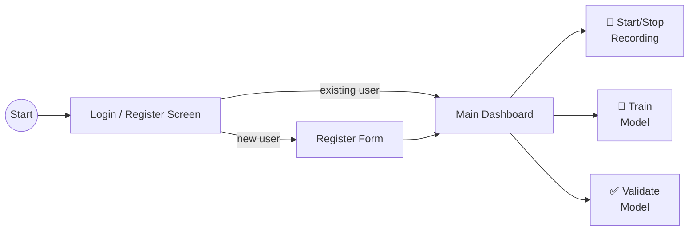

# gui/

PySide6 desktop GUI for the Human Input Recorder.

<a id="folder-structure"></a>

## Folder Structure

```
📁 gui/
  📝 __gui.md
  🐍 __init__.py
  🐍 login_screen.py
  🐍 main_dashboard.py
  🐍 validation_screen.py
  🐍 styles.py
  🐍 user_db.py
```

<a id="application-flow"></a>

## Application Flow



### Screen 1: Login / Register

First-time users register with:

| Field | Required | Purpose |
|-------|----------|---------|
| Username | ✅ | Unique identifier for login |
| Surname | ✅ | Personal profile |
| Date of birth | ✅ | Personal profile |

This creates a **personal profile** — the model being trained is THEIR
personalized robot. Profile data stored locally in SQLite.

Returning users log in with username only.

### Screen 2: Main Dashboard

Three primary actions:

| Action | Description |
|--------|-------------|
| **Start/Stop Recording** | Starts capturing mouse + keyboard input. Toggle button (Start ↔ Stop). Data goes into the user's personal database. |
| **Train Model** | Takes recorded data and trains the ML model. Can retrain anytime with new data. Placeholder for now — actual training pipeline built later. |
| **Validate Model** | Tests model accuracy against real behavior. Mouse and keyboard validated separately. Shows similarity percentage. |

**Validation details:**
- **Mouse:** Waits for user's movement (start→end), model predicts path shape, compares with actual
- **Keyboard:** Model predicts timing/delays, compares with actual typing

<a id="files"></a>

## Files

### `login_screen.py` — Login / Register Page

Two tabs: Login and Register. Register collects username, surname,
date of birth. Login requires username only. Profile stored in
`profiles` table in SQLite.

### `main_dashboard.py` — Main Control Panel

Three buttons + status area. Shows current user info, recording
status, model status, and system info panel.

**System Info panel** displays live system data:

| Field | Source | Example |
|-------|--------|---------|
| Keyboard Layout | `SystemMonitor` | `0x04090409` |
| Polling Rate | `PollingRateEstimator` | `~1000 Hz` |
| Mouse Speed | `SystemMonitor` | `10` |
| Acceleration | `SystemMonitor` | `On` / `Off` |
| Resolution | `SystemMonitor` | `1920x1080` |

Updated via `update_system_info()` method called from the application layer.

### `validation_screen.py` — Model Validation View

Split view: mouse validation on left, keyboard validation on right.
Shows real-time comparison scores during validation session.

### `styles.py` — Shared QSS Stylesheet

Consistent dark theme for the application.

### `user_db.py` — User Profile Database

Manages the `profiles` table for login/register. Separate from
the main recording database (`data/movements.db`).

<a id="relationship-to-ui"></a>

## Relationship to ui/

| Package | Purpose | Technology | When it runs |
|---------|---------|------------|--------------|
| `ui/` | System tray icon (minimal) | pystray + Pillow | During recording |
| `gui/` | Full desktop application | PySide6 | User-facing dashboard |

> **Note:** These are separate concerns. The tray icon runs silently during recording.
> The GUI is the main application for managing profiles, starting recording, training, and validation.
