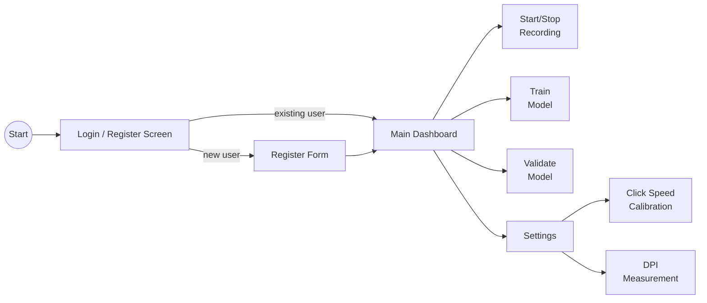

# gui/

PySide6 desktop GUI for the Human Input Recorder.

<a id="folder-structure"></a>

## Folder Structure

```
📁 gui/
  📝 __gui.md
  🐍 __init__.py
  🐍 login_screen.py
  🐍 main_dashboard.py
  🐍 settings_screen.py
  🐍 validation_screen.py
  🐍 styles.py
  🐍 user_db.py
  🐍 user_settings.py
```

<a id="application-flow"></a>

## Application Flow



### Screen 1: Login / Register

First-time users register with:

| Field | Required | Purpose |
|-------|----------|---------|
| Username | Yes | Unique identifier for login |
| Surname | Yes | Personal profile |
| Date of birth | Yes | Personal profile |

This creates a **personal profile** — the model being trained is THEIR
personalized robot. Profile data stored locally in SQLite (`profiles.db`).

Returning users log in with username only. Each user gets their own
recording database at `data/db/user_{id}/movements.db`.

### Screen 2: Main Dashboard

Three primary actions + Settings:

| Action | Description |
|--------|-------------|
| **Start/Stop Recording** | Starts capturing mouse + keyboard input. Toggle button (Start / Stop). Data goes into the user's personal database. |
| **Train Model** | Takes recorded data and trains the ML model. Can retrain anytime with new data. Placeholder for now — actual training pipeline built later. |
| **Validate Model** | Tests model accuracy against real behavior. Mouse and keyboard validated separately. Shows similarity percentage. |
| **Settings** | Opens the settings page for recording and system configuration. |
| **Export Data** | Exports the user's recording database files to a chosen location. |

**Validation details:**
- **Mouse:** Waits for user's movement (start->end), model predicts path shape, compares with actual
- **Keyboard:** Model predicts timing/delays, compares with actual typing

### Screen 3: Settings

Per-user configurable options stored in `profiles.db` via the `user_settings` table.

**Recording settings:**

| Setting | Control | Range | Default |
|---------|---------|-------|---------|
| Downsampling | Dropdown | Off, 125-8000 Hz | Off |
| Session timeout | Slider | 100-1000 ms | 300 ms |
| Min session distance | Slider | 0-20 px | 3 px |
| DB max size | Dropdown | 1-10 GB | 5 GB |
| Pause hotkey | Key sequence | Any combo | Ctrl+Alt+R |

**System settings:**

| Setting | Control | Default |
|---------|---------|---------|
| Start with Windows | Checkbox | Off |
| Mouse DPI | SpinBox + Measure button | 800 |

**Calibration:**

| Calibration | Method |
|-------------|--------|
| Click speed | Interactive: click 20 times fast, measures natural gap |
| DPI | Interactive: drag across known physical distance |

Settings override `config.py` defaults at login via `config.apply_user_settings()`.
Reset to defaults restores original values and clears saved settings.

<a id="files"></a>

## Files

### `login_screen.py` — Login / Register Page

Two tabs: Login and Register. Register collects username, surname,
date of birth. Login requires username only. Profile stored in
`profiles` table in SQLite.

### `main_dashboard.py` — Main Control Panel

Action buttons + status area. Shows current user info, recording
status, model status, and system info panel.

**System Info panel** displays live system data:

| Field | Source | Example |
|-------|--------|---------|
| Keyboard Layout | `SystemMonitor` | `0x04090409` |
| Polling Rate | `PollingRateEstimator` | `~1000 Hz` |
| Mouse Speed | `SystemMonitor` | `10` |
| Acceleration | `SystemMonitor` | `On` / `Off` |
| Resolution | `SystemMonitor` | `1920x1080` |

Updated via `update_system_info()` method called from the application layer.

### `settings_screen.py` — Settings Page

Per-user settings with recording config, system options, and calibration.
Reads current values from `config.*` on load, saves to `user_settings`
table on Save. Emits `settings_changed_signal` when settings are saved
and `calibrate_click_signal` / `calibrate_dpi_signal` for calibration dialogs.

### `validation_screen.py` — Model Validation View

Split view: mouse validation on left, keyboard validation on right.
Shows real-time comparison scores during validation session.

### `styles.py` — Shared QSS Stylesheet

Consistent dark theme for the application. Covers all widget types:
buttons, inputs, combos, sliders, spinboxes, checkboxes, tabs,
group boxes, progress bars, and key sequence editors.

### `user_db.py` — User Profile Database

Manages the `profiles` table for login/register. Separate from
the recording database (per-user `movements.db`).

### `user_settings.py` — Per-user Settings Persistence

Key-value settings table in `profiles.db`. Each setting is scoped
to a `user_id`. Functions: `save_setting()`, `save_settings()`,
`load_settings()`, `load_setting()`, `delete_settings()`.

Settings keys follow `category.name` convention (e.g. `recording.downsample_hz`).

<a id="relationship-to-ui"></a>

## Relationship to ui/

| Package | Purpose | Technology | When it runs |
|---------|---------|------------|--------------|
| `ui/` | System tray icon (minimal) | pystray + Pillow | During recording |
| `gui/` | Full desktop application | PySide6 | User-facing dashboard |

> **Note:** These are separate concerns. The tray icon runs silently during recording.
> The GUI is the main application for managing profiles, starting recording, training, and validation.
