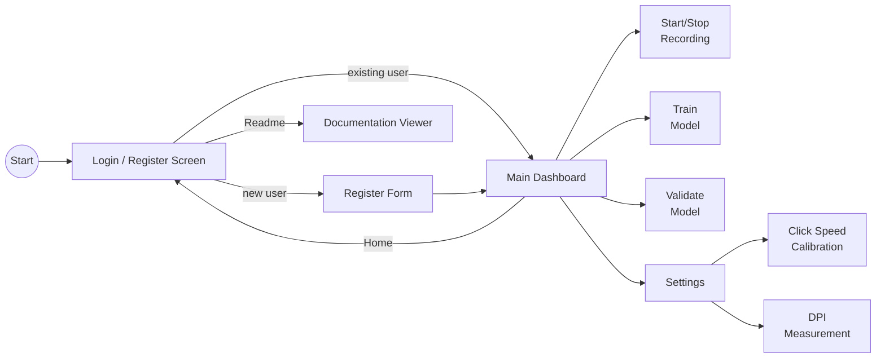

# gui/

PySide6 desktop GUI for the Human Input Recorder.

<a id="folder-structure"></a>

## Folder Structure

```
📁 gui/
  📝 __gui.md
  🐍 __init__.py
  🐍 calibration_dialog.py
  🐍 dpi_dialog.py
  🐍 export_utils.py
  🐍 global_settings.py
  🐍 global_settings_dialog.py
  🐍 login_screen.py
  🐍 main_dashboard.py
  🐍 readme_viewer.py
  🐍 settings_screen.py
  🐍 validation_screen.py
  🐍 styles.py
  🐍 user_db.py
  🐍 user_settings.py
```

<a id="application-flow"></a>

## Application Flow



> **Note:** The Home button navigates to the login screen WITHOUT stopping
> recording. This allows access to Global Settings while recording runs.
> A "← Dashboard" button appears on the login screen to return.

### Screen 1: Login / Register

First-time users register with:

| Field | Required | Purpose |
|-------|----------|---------|
| Username | Yes | Unique identifier for login |
| Surname | Yes | Personal profile |
| Date of birth | Yes | Personal profile |

This creates a **personal profile** — the model being trained is THEIR
personalized robot. Profile data stored locally in SQLite (`profiles.db`).

Returning users log in with username only. Each user gets their own
recording databases at `data/db/Username_Surname_YYYY-MM-DD/`.

When a user is already logged in (navigated here via Home button), the Login
button is disabled and a recording status indicator appears at the bottom
(green/yellow tray icon + text). A "← Dashboard" button appears at the top
to return to the active session.

A **Settings** button (bottom-right) opens the Global Settings dialog for
application-wide options (default user, autostart, minimize on close, etc.).

A **Readme** button (top-right, always visible) opens the documentation
viewer showing README.md with clickable links to all project docs.

### Screen 2: Main Dashboard

Three primary actions + Settings:

| Action | Description |
|--------|-------------|
| **Start/Stop Recording** | Starts capturing mouse + keyboard input. Toggle button (Start / Stop). Data goes into the user's personal database. |
| **Train Model** | Takes recorded data and trains the ML model. Can retrain anytime with new data. Placeholder for now — actual training pipeline built later. |
| **Validate Model** | Tests model accuracy against real behavior. Mouse and keyboard validated separately. Shows similarity percentage. |
| **Settings** | Opens the settings page for recording and system configuration. |
| **Export Data** | Exports the user's recording database files to a chosen location. |

**Validation details:**
- **Mouse:** Waits for user's movement (start->end), model predicts path shape, compares with actual
- **Keyboard:** Model predicts timing/delays, compares with actual typing

### Global Settings (Login Screen)

Application-wide settings accessible from the login screen via the Settings button.
Stored in `global_settings` table in `profiles.db`. Loaded at app start before login.

| Setting | Control | Default |
|---------|---------|---------|
| Theme | Dropdown: Dark / Light / Windows | Dark |
| Data location | Browse/Reset | `data/db/` |
| Default user | Dropdown: None + all profiles | None |
| Start recording with Windows startup | Checkbox | Off |
| Minimize on close | Checkbox | Off |

Theme changes apply immediately (live switching) without restart.
The "Windows" option follows the system theme (light/dark) detected from the registry.

**Default user + Start with Windows:** When both are configured, the app
auto-logs in the default user, auto-starts recording, and stays in the
system tray without showing the GUI window. The installed EXE is registered
in the Windows Run key with `--autostart` flag.

**Minimize on close:** When enabled, the window close button (X) hides the
window to the system tray instead of exiting. Only right-click → Quit on
the tray icon actually closes the application.

### Screen 3: Per-User Settings

Per-user configurable options stored in `profiles.db` via the `user_settings` table.

**Recording settings:**

| Setting | Control | Range | Default |
|---------|---------|-------|---------|
| Downsampling | Dropdown | Off, 125-8000 Hz | Off |
| Session timeout | Slider | 100-1000 ms | 300 ms |
| Min session distance | Slider | 0-20 px | 3 px |
| DB max size | Dropdown | 1-10 GB | 5 GB |
| Pause hotkey | Key sequence | Any combo | Ctrl+Alt+R |

**System settings:**

| Setting | Control | Default |
|---------|---------|---------|
| Mouse DPI | SpinBox + Measure button | 800 |

**Calibration:**

| Calibration | Method |
|-------------|--------|
| Click speed | Interactive: click 20 times fast, measures natural gap |
| DPI | Interactive: drag across known physical distance |

Settings override `config.py` defaults at login via `config.apply_user_settings()`.
Reset to defaults restores original values and clears saved settings.

<a id="files"></a>

## Files

### `global_settings.py` — Global Settings Persistence

CRUD for the `global_settings` table in `profiles.db`. Stores
application-wide key-value settings (not scoped to any user).
Functions: `save_global()`, `save_globals()`, `load_globals()`,
`load_global()`.

### `global_settings_dialog.py` — Global Settings Dialog

QDialog opened from the login screen's Settings button. Contains
theme selector (Dark/Light/Windows), data location (Browse/Reset),
default user dropdown, start recording with Windows startup checkbox,
and minimize on close checkbox. Theme changes apply live via
`QApplication.instance().setStyleSheet()`. Also contains Windows
registry autostart functions (`_set_autostart` adds `--autostart`
flag for the frozen EXE).

### `login_screen.py` — Login / Register Page

Two tabs: Login and Register. Register collects username, surname,
date of birth. Login requires username only. Profile stored in
`profiles` table in SQLite. Settings button (bottom-right) opens
the Global Settings dialog.

When navigated to via the Home button (while a user is logged in):
- "← Dashboard" button appears at the top to return
- Login button is disabled (grayed) to prevent user switching
- Recording status indicator shows at the bottom (green/yellow
  tray icon + status text)
- Registration of new users still works

Signals: `login_success(UserProfile)`, `back_to_dashboard`, `readme_signal`.

### `main_dashboard.py` — Main Control Panel

Action buttons + status area. Shows current user info, recording
status, model status, and system info panel. Home button (top-left)
navigates to the login screen without stopping recording.

**Recording Statistics** panel has two side-by-side group boxes:

| Mouse | Keyboard |
|-------|----------|
| Movements | Keystrokes |
| Clicks (Left / Right / Middle) | (Upper / Lower / Code) |
| (Double / Triple / Spam) | (Number / Numpad / Other) |
| Drags | Shortcuts |
| Scrolls | Words |

A shared navigation bar above the stats toggles between **Total** and
**Last N min** views (left/right arrow buttons). N is read from
`config.STATS_WINDOW_MINUTES` (per-user setting, default 30 min).

Stats are updated via `update_stats(totals, windowed)` called from the
main thread timer. Both arguments are `dict[str, int]` from `StatsTracker`.
All data comes from RAM — no database reads.

**System Info panel** displays live system data:

| Field | Source | Example |
|-------|--------|---------|
| Keyboard Layout | `SystemMonitor` | `0x04090409` |
| Polling Rate | `PollingRateEstimator` | `~1000 Hz` |
| Mouse Speed | `SystemMonitor` | `10` |
| Acceleration | `SystemMonitor` | `On` / `Off` |
| Resolution | `SystemMonitor` | `1920x1080` |

Updated via `update_system_info()` method called from the application layer.

### `readme_viewer.py` — Documentation Viewer

Full-screen widget for browsing project `.md` files. Accessible from
the login screen via the Readme button (top-right). Uses QWebEngineView
(Chromium) with Python's `markdown` library (tables, fenced_code, toc
extensions) for rendering. Mermaid diagrams rendered via CDN.

**Navigation bar:** ← Back (return to login), ◀/▶ (file history
back/forward), file path label, Home (reset to README.md).

**Link handling:** Internal `.md` links load in the viewer. External
URLs open in the system browser. Fragment links (`#section`) scroll
within the document.

**Theme:** HTML/CSS generated at render time from the active palette
(`DARK_PALETTE` / `LIGHT_PALETTE`), matching the application theme.

Signal: `back_signal` (return to login screen).

### `settings_screen.py` — Per-User Settings Page

Per-user settings with recording config, DPI, and calibration.
Reads current values from `config.*` on load, saves to `user_settings`
table on Save. Emits `settings_changed_signal` when settings are saved
and `calibrate_click_signal` / `calibrate_dpi_signal` for calibration dialogs.

**Recording settings:** Downsampling, Session timeout, Min distance,
DB max size, Stats window (10-60 min in 10-min increments).

Global settings (data location, autostart) are NOT here — they are in
`global_settings_dialog.py` accessible from the login screen.

### `validation_screen.py` — Model Validation View

Split view: mouse validation on left, keyboard validation on right.
Shows real-time comparison scores during validation session.

### `styles.py` — Theme System

Palette-based theme system with dark and light themes. Colors are
extracted from the InputDNA SVG brand logos (`support/logo/dark/` and
`support/logo/light/UV-InputDNA.svg`).

**Architecture:**
- `DARK_PALETTE` / `LIGHT_PALETTE` — dicts mapping color roles to hex values
- `_QSS_TEMPLATE` — `string.Template` with `$variable` references
- `DARK_STYLE` / `LIGHT_STYLE` — pre-built QSS strings
- `get_stylesheet(theme)` — returns QSS for "dark", "light", or "auto"

**Object name selectors** (used by other GUI files instead of inline styles):
`#stat-value`, `#info-value`, `#hint`, `#hint-small`, `#hint-dim`,
`#result-value`, `#result-value-large`, `#score-value`, `#count-value`,
`#log-area`, `#drag-area`, `#readme-nav`.

All widget types covered: buttons, inputs, combos, sliders, spinboxes,
checkboxes, tabs, group boxes, progress bars, calendar, and key sequence editors.

### `user_db.py` — User Profile Database

Manages the `profiles` table for login/register. Separate from
the recording databases (per-user `mouse.db`, `keyboard.db`, `session.db`).

### `user_settings.py` — Per-user Settings Persistence

Key-value settings table in `profiles.db`. Each setting is scoped
to a `user_id`. Functions: `save_setting()`, `save_settings()`,
`load_settings()`, `load_setting()`, `delete_settings()`.

Settings keys follow `category.name` convention (e.g. `recording.downsample_hz`).

### `calibration_dialog.py` — Click Speed Calibration

Modal dialog: user clicks a button 20 times as fast as possible.
Measures inter-click intervals, discards first gap (reaction time),
calculates 95th percentile as the user's click threshold. Shows
Windows system double-click time as reference. Saves result to
`recording.click_sequence_gap_ms` in user settings.

### `dpi_dialog.py` — DPI Measurement

Modal dialog: user enters a known physical distance (cm), then
drags the mouse across that distance. Uses Windows Raw Input API
(`WM_INPUT` + `GetRawInputData`) to capture actual mouse sensor
counts, bypassing OS pointer speed and Enhanced Pointer Precision.
Calculates DPI from raw counts and physical distance. Alternative
to manual DPI entry in settings.

### `export_utils.py` — Data Export Utilities

Functions for copying user's recording database files to an
external location. Finds all `.db` files in the user's data
folder (active + rotated archives) and copies them with `shutil.copy2`.

<a id="relationship-to-ui"></a>

## Relationship to ui/

| Package | Purpose | Technology | When it runs |
|---------|---------|------------|--------------|
| `ui/` | System tray icon (minimal) | pystray + Pillow | Always (entire app lifetime) |
| `gui/` | Full desktop application | PySide6 | User-facing dashboard |

> **Note:** These are separate concerns. The tray icon runs in the background
> for the entire app lifetime. Double-click opens the GUI. The GUI is the main
> application for managing profiles, starting recording, training, and validation.
