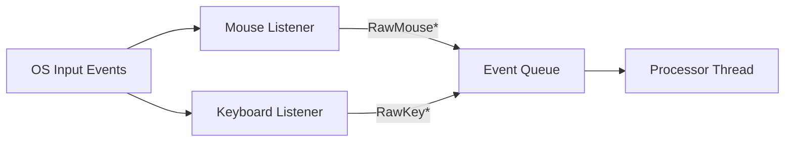
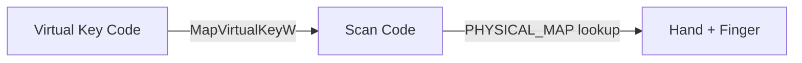

# listeners/

Low-level OS event hooks. Each listener runs in its own thread and pushes
raw events to a shared queue for processing.

Listeners are intentionally DUMB — they capture what the OS gives them,
attach a precise timestamp, and push to the queue. No analysis, no filtering.

<a id="folder-structure"></a>

## Folder Structure

```
📁 listeners/
  📝 __listeners.md
  🐍 __init__.py
  🐍 mouse_listener.py
  🐍 keyboard_listener.py
```

<a id="files"></a>

## Files

### `mouse_listener.py` — Mouse Event Capture

Uses Windows Raw Input API (`WM_INPUT`) via a hidden message-only window
(`HWND_MESSAGE`) instead of `WH_MOUSE_LL` (pynput). Timestamps are captured
via `time.perf_counter_ns()` as the very first operation in the `WM_INPUT`
handler — before `GetCursorPos()`, before queue.put() — giving sub-millisecond
accuracy unaffected by cross-process hook delivery jitter.

`WH_MOUSE_LL` caused false polling rate readings (3–5ms medians on a 500Hz mouse)
because events were delivered via synchronous cross-process `SendMessage` with
variable scheduling jitter. `WM_INPUT` is posted directly to a dedicated message
pump thread and is never coalesced by the OS.

Absolute cursor coordinates come from `GetCursorPos()` called immediately
after the QPC timestamp capture. `RAWMOUSE.lLastX/lLastY` (relative movement)
is used only to detect that motion occurred.

Logs a timing quality report every `TIMING_QUALITY_LOG_INTERVAL_S` (default
5 minutes) showing inter-move interval distribution (P10/P50/P90) and
percentage of clean intervals — visible in logs without reading the database.

**Events produced:**

| Event | Trigger | Data |
|-------|---------|------|
| `RawMouseMove` | Cursor moved (rel_x≠0 or rel_y≠0) | x, y, t_ns |
| `RawMouseClick` | Button pressed/released | x, y, button, pressed, t_ns |
| `RawMouseScroll` | Scroll wheel (vertical or horizontal) | x, y, dx, dy, t_ns |

### `keyboard_listener.py` — Keyboard Event Capture

Wraps `pynput.keyboard.Listener` to capture key press/release events.
Extracts scan codes (physical key position) for layout-independent tracking.
Maintains modifier state (`ctrl`, `alt`, `shift`, `win`) internally.

**Events produced:**

| Event | Trigger | Data |
|-------|---------|------|
| `RawKeyPress` | Key pressed down | scan_code, vkey, key_name, t_ns, modifier_state, active_layout |
| `RawKeyRelease` | Key released | scan_code, key_name, t_ns, press_duration_ms |

Calculates key press duration (press→release) and pushes completed
`RawKeyRelease` events with duration attached.

**Key name resolution:** When a modifier is held (e.g. Ctrl+C), pynput gives
`key.char` as the ASCII control character (`'\x03'`) instead of the letter.
`_name_from_vk()` detects control characters (ord < 0x20) and resolves the
human-readable name from the virtual key code instead — using direct ASCII
mapping for A-Z and 0-9, and `GetKeyNameTextW` for other keys.

<a id="data-flow"></a>

## Data Flow



<a id="thread-safety"></a>

## Thread Safety

Both listeners push to the same `queue.Queue` which is thread-safe.
The processor thread is the sole consumer.

| Component | Thread | Role |
|-----------|--------|------|
| `MouseListener` | Thread 1 | Producer |
| `KeyboardListener` | Thread 2 | Producer |
| `EventProcessor` | Thread 3 | Consumer |

<a id="scan-code-extraction"></a>

## Scan Code Extraction

On Windows, pynput's key events contain a `vk` (virtual key code) but
not always a scan code directly. We use `ctypes.windll.user32.MapVirtualKeyW`
to convert vk → scan code when needed.



For special keys (extended keys like Right Ctrl, arrows, numpad Enter),
we handle the extended flag to produce correct extended scan codes
(e.g., `0xE01D` for Right Ctrl).

> **Warning:** Virtual key codes are layout-dependent. Scan codes are not.
> Always use scan codes for timing analysis.
