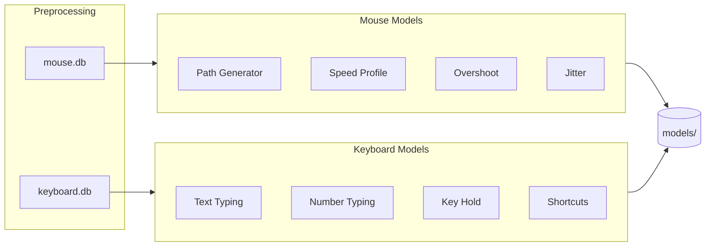

# ml/

ML training pipeline for InputDNA. Trains personalized models from recorded mouse and keyboard data. Each user gets their own set of models that capture their unique input patterns.

## Architecture

**Ensemble of specialized models** — not one monolithic model. Each sub-model handles a specific aspect of behavior (path shape, speed profile, typing rhythm, etc.). This allows:
- Training with limited data (statistical models work with 50+ samples)
- Easy upgrades (replace one model without affecting others)
- Interpretable results (each model has clear metrics)

**Training is triggered by the "Train Model" button** in the GUI dashboard. The pipeline runs in a background thread with progress reporting back to the UI.



## Files

### `training.py` — Training Orchestrator
Main entry point. Runs the full pipeline: preprocessing → train all models → save. Reports progress via callback for the GUI progress bar. Called from `main.py` in a background thread.

### `preprocessing/mouse_data.py` — Mouse Data Extraction
Loads movements and path points from `mouse.db`. Reconstructs absolute coordinates from delta-encoded `path_points`. Computes features (distance, angle, duration) for each movement.

### `preprocessing/keyboard_data.py` — Keyboard Data Extraction
Loads key transitions, keystrokes, and shortcuts from `keyboard.db`. Computes inter-key delays from consecutive transition timestamps. Groups data by typing mode (text, numpad, code).

### `mouse/path_model.py` — Path Generator (KNN)
Generates realistic mouse paths between two points. Normalizes all recorded paths (translate to origin, scale to unit distance, rotate to x-axis), then uses K-Nearest Neighbors to find similar recorded movements and denormalize them to the target coordinates.

**Why KNN over VAE:** Works with any amount of data, outputs are always realistic (they ARE real recorded paths), no training convergence issues. VAE can be added later for infinite variation.

### `mouse/speed_model.py` — Speed Profile
Learns the user's characteristic speed curve: how they accelerate at start, cruise in middle, decelerate at end. Based on the minimum jerk model from motor control theory. Represented as normalized position (0→1) mapped to normalized speed.

### `mouse/overshoot_model.py` — Overshoot Predictor
Detects and models target overshoot (moving past the target and correcting back). Uses logistic regression for probability (depends on distance, speed) and statistical distributions for magnitude and correction time.

### `mouse/jitter_model.py` — Micro-Jitter
Captures hand tremor characteristics. Extracts jitter amplitude from slow-movement segments by comparing raw path to smoothed version. Uses multi-octave sinusoidal noise at ~8Hz (human physiological tremor frequency) for generation.

### `keyboard/text_model.py` — Text Typing Digraph
Per scan-code pair (from_key → to_key) timing distribution. Combines `text` and `code` typing modes. Falls back to global estimate adjusted by physical key distance for unseen pairs. Includes key position map for distance calculation.

### `keyboard/number_model.py` — Number/Numpad Typing Digraph
Separate model for numpad typing — fundamentally different patterns (single hand, compact layout, often faster and more rhythmic). Trained exclusively on `typing_mode="numpad"` data. Includes numpad-specific key position map.

### `keyboard/hold_model.py` — Key Hold Duration
Per-key Gaussian distribution of how long the user holds each key. Falls back to global average for unseen keys. Uses trimmed statistics (5th-95th percentile) to remove outliers.

### `keyboard/shortcut_model.py` — Shortcut Timing
Per-combo timing profiles: modifier→main delay, main key hold duration, total duration, release order preference. Falls back to global medians for unseen shortcuts.

## Model Storage

Models are saved in the user's data folder:
```
{user_folder}/models/
  path_generator.pkl      # KNN + normalized paths
  speed_profile.pkl       # Statistical percentiles
  overshoot_model.pkl     # LogReg + distributions
  jitter_params.pkl       # Amplitude + frequency
  text_typing.pkl         # Digraph lookup table
  number_typing.pkl       # Numpad digraph table
  key_hold.pkl            # Per-key hold durations
  shortcuts.pkl           # Per-combo timing profiles
  metadata.json           # Training date, duration, model status
```

## Technology Choices

| Choice | Why |
|--------|-----|
| **scikit-learn** (KNN, LogReg) | Simple, proven, fast training, works with limited data |
| **scipy** (interpolation, stats) | Statistical distributions, signal processing |
| **numpy** | Core numerical operations |
| **pickle** for model storage | scikit-learn standard, fast save/load |
| **No PyTorch yet** | Current models are statistical/KNN — deep learning comes in Phase 3 when VAE path generator is added |

## Design Decisions

### Why per-pair statistics over a single neural network?
Keystroke biometrics research shows that per-digraph distributions are the gold standard for user identification. A neural network would need orders of magnitude more data and would produce less interpretable, less reliable results. The lookup table approach matches the proven KD (Keystroke Dynamics) literature.

### Why separate text vs number models?
User explicitly requested this. Numpad typing is fundamentally different: single hand, compact layout, different rhythm. Combining them would dilute both patterns.

### Why KNN for path generation?
With 64K+ recorded movements, KNN gives excellent results immediately — every generated path IS a real user path, just adapted to different coordinates. VAE would generate novel paths but needs careful training and validation. KNN is the right MVP choice.

### Why statistical speed profile over neural network?
The minimum jerk model from motor control theory already describes human movement well. We just need to fit the user's specific parameters (peak speed position, acceleration rate, deceleration rate). A neural network would be overkill for what is essentially a smooth bell-shaped curve.

## Minimum Data Requirements

| Model | Minimum | Ideal |
|-------|---------|-------|
| Path Generator | 50 movements | 10,000+ |
| Speed Profile | 30 movements | 5,000+ |
| Overshoot | 100 click-movements | 1,000+ |
| Jitter | 50 slow segments | 500+ |
| Text Digraph | 3 per pair | 50+ per pair |
| Number Digraph | 3 per pair | 50+ per pair |
| Key Hold | 3 per key | 100+ per key |
| Shortcuts | 2 per combo | 20+ per combo |

Models with insufficient data are skipped or use sensible defaults.
