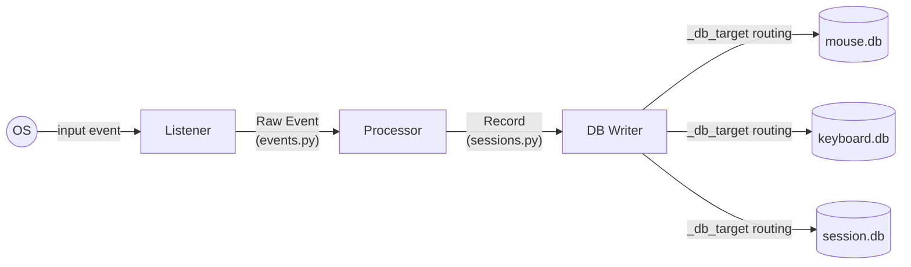

# models/

Data classes used throughout the recorder. These are NOT ML models — they are
plain Python dataclasses that define the shape of data flowing through the system.

<a id="folder-structure"></a>

## Folder Structure

```
📁 models/
  📝 __models.md
  🐍 __init__.py
  🐍 events.py
  🐍 sessions.py
```

<a id="files"></a>

## Files

### `events.py` — Raw Events (from listeners)

Raw events produced by mouse and keyboard listeners. These are the first thing
created when the OS reports an input event. They contain only what the OS gives
us plus a precise timestamp.

**Mouse events:**

| Class | Trigger | Fields |
|-------|---------|--------|
| `RawMouseMove` | Cursor moved | `x`, `y`, `t_ns` |
| `RawMouseClick` | Button pressed/released | `x`, `y`, `button`, `pressed`, `t_ns` |
| `RawMouseScroll` | Scroll wheel | `x`, `y`, `dx`, `dy`, `t_ns` |

**Keyboard events:**

| Class | Trigger | Fields |
|-------|---------|--------|
| `RawKeyPress` | Key pressed | `scan_code`, `vkey`, `key_name`, `t_ns`, `modifier_state`, `active_layout` |
| `RawKeyRelease` | Key released | `scan_code`, `key_name`, `t_ns`, `press_duration_ms` |

> **Note:** All timestamps use `time.perf_counter_ns()` — monotonic, integer nanoseconds,
> sub-microsecond precision. Never floats, never wall clock.

All event classes use `@dataclass(slots=True)` for minimal memory footprint
since thousands of these are created per second during active use.

### `sessions.py` — Processed Records (for database)

Processed records produced by processors after analyzing raw events.
Each has a `write_to_db(conn)` method that knows how to INSERT itself
into the correct table(s), and a `_db_target` class attribute that tells
the writer which database to use.

**Database routing via `_db_target`:**

| `_db_target` | Database | Record classes |
|--------------|----------|---------------|
| `"mouse"` | mouse.db | MovementSession, ClickSequence, DragRecord, ScrollEvent |
| `"keyboard"` | keyboard.db | KeystrokeRecord, KeyTransitionRecord, ShortcutRecord |
| `"session"` | session.db | SystemEventRecord, RecordingSessionRecord |

**Mouse records:**

| Class | DB Table(s) | Description |
|-------|-------------|-------------|
| `MovementSession` | `movements` + `path_points` | Complete movement with full path; `start_t_ns`/`end_t_ns` bookends; app-generated `movement_id` |
| `SingleClick` | — (embedded in ClickSequence) | One click within a sequence: `press_duration_ms`, `t_ns` |
| `ClickSequence` | `click_sequences` + `click_details` | Group of clicks (1, 2, 3+); `button`, `clicks`, `movement_id` |
| `DragRecord` | `drags` + `drag_points` | Click-hold-move-release; app-generated `drag_id`; `start_t_ns`/`end_t_ns` |
| `ScrollEvent` | `scrolls` | Single scroll event: `delta`, `x`, `y`, `t_ns`, `movement_id` |

**Keyboard records:**

| Class | DB Table | Description |
|-------|----------|-------------|
| `KeystrokeRecord` | `keystrokes` | One key press: `scan_code`, `press_duration_ms`, `modifier_state` (bitmask), `t_ns` |
| `KeyTransitionRecord` | `key_transitions` | Delay between two consecutive keys: `from_scan`, `to_scan`, `typing_mode`, `t_ns` |
| `ShortcutRecord` | `shortcuts` | Modifier+key combo timing profile |

**Meta records:**

| Class | DB Table | Description |
|-------|----------|-------------|
| `SystemEventRecord` | `system_events` | Tracks a system state change |
| `RecordingSessionRecord` | `recording_sessions` | One recording period (start→stop) |

**Shared helpers:**

| Function | Description |
|----------|-------------|
| `_delta_encode_points()` | Converts a list of PathPoints to delta-encoded tuples for DB storage (seq=0 absolute, seq>0 deltas). No t_ns in output — timing reconstructed from movement/drag `start_t_ns`/`end_t_ns`. |

<a id="data-flow"></a>

## Data Flow



<a id="design-decisions"></a>

## Design Decisions

| Decision | Rationale |
|----------|-----------|
| `PathPoint.t_ns` kept in model | Used internally for downsampling and to extract `start_t_ns`/`end_t_ns` — but NOT written to DB |
| No `t_ns` per path point in DB | Timing reconstructed as `start_t_ns + i × (end_t_ns - start_t_ns) / (N-1)` — more accurate than jittered per-point timestamps from WH_MOUSE_LL |
| App-generated movement/drag IDs | Format `session_id × 1_000_000 + seq` — processor knows ID before DB write, links clicks/drags to sessions immediately |
| `modifier_state` as `int` bitmask | `bit0=Ctrl, bit1=Alt, bit2=Shift, bit3=Win` — 1 byte vs ~62-byte JSON string per keystroke |
| Derivable fields removed | `key_name`, `hand`, `finger`, `vkey`, `active_layout`, `delay_ms`, `duration_ms`, `click_count`, `direction` — all computable in post-processing |

> **Schema version:** `path_encoding=delta_v2` in mouse.db metadata table.
> See [docs/08-schema-optimization.md](../docs/08-schema-optimization.md) for full rationale.

> **Note:** Raw events are lightweight and short-lived (queue transit only).
> Processed records are richer and persist to disk via `write_to_db()`.
