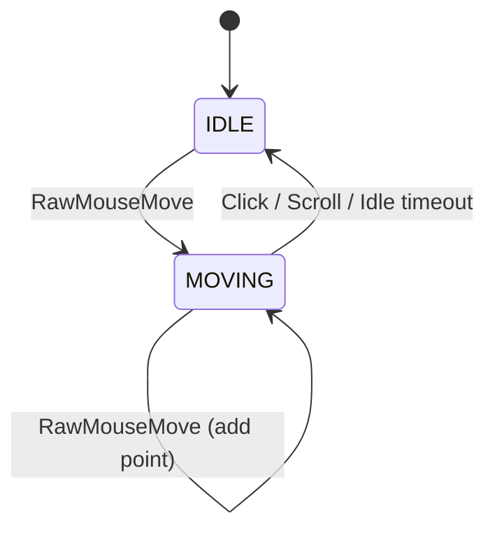
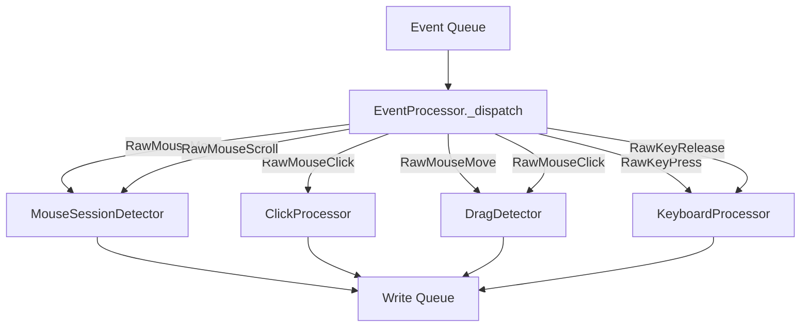

# processors/

Event processors that consume raw events from listeners and produce
structured records for the database.

All processors run in a single processor thread. The `EventProcessor`
class (in `__init__.py`) dispatches raw events to the appropriate
sub-processor based on event type.

<a id="folder-structure"></a>

## Folder Structure

```
📁 processors/
  📝 __processors.md
  🐍 __init__.py            ← EventProcessor (central dispatcher)
  🐍 mouse_session.py
  🐍 click_processor.py
  🐍 drag_detector.py
  🐍 keyboard_processor.py
```

<a id="files"></a>

## Files

### `__init__.py` — EventProcessor (Central Dispatcher)

Routes raw events from the shared queue to the correct sub-processor.
Runs in a dedicated thread. Also periodically checks idle/sequence
timeouts on sub-processors.

### `mouse_session.py` — Movement Session Detector

Groups consecutive `RawMouseMove` events into movement sessions. A session
starts when the mouse first moves after being idle, and ends when:

| Trigger | `end_event` value |
|---------|-------------------|
| Left click | `"left_click"` |
| Right click | `"right_click"` |
| Middle click | `"middle_click"` |
| Scroll | `"scroll_up"`, `"scroll_down"`, etc. |
| Idle timeout | `"idle"` |
| Shutdown | `"flush"` |

**State machine:**



Calculates basic metrics: duration, distance, path length, point count.

> **Note:** Does NOT calculate derived analytics (overshoot, speed profiles, curvature).
> Those are post-processing tasks.

### `click_processor.py` — Click Sequence Builder

Groups clicks into sequences: single click (1), double click (2), or
spam clicks (3+). Clicks within `CLICK_SEQUENCE_GAP_MS` of each other
are part of the same sequence.

**What it tracks per click:**

| Metric | Description |
|--------|-------------|
| `press_duration_ms` | Mouse down → mouse up |
| `delay_since_prev_ms` | Gap from previous click in sequence |
| `x, y` | Position at mouse down |
| `t_ns` | Precise timestamp |

### `drag_detector.py` — Drag Operation Detector

Detects click-hold-move-release patterns. If the mouse moves more than
`DRAG_MIN_DISTANCE_PX` while a button is held down, it's classified as a
drag operation instead of a click. Records the full drag path.

> **Note:** When a drag is active, mouse moves are consumed by the drag detector
> and NOT forwarded to the session detector. This prevents drag paths from
> being counted as regular movement sessions.

### `keyboard_processor.py` — Keystroke & Transition Tracker

Processes keyboard events to produce three record types:

| Record Type | What it captures |
|-------------|------------------|
| `KeystrokeRecord` | Individual key press: scan code, duration, hand/finger |
| `KeyTransitionRecord` | Delay between consecutive keys (scan code pairs) |
| `ShortcutRecord` | Modifier+key combo with full timing profile |

**Typing mode detection:**

| Mode | Condition |
|------|-----------|
| `"shortcut"` | Active modifier (ctrl/alt/win) |
| `"numpad"` | Numpad scan codes |
| `"code"` | Brackets, operators, etc. |
| `"text"` | Default — letters, spaces |

<a id="event-flow"></a>

## Event Flow



<a id="what-recorder-does-not-do"></a>

## What the Recorder Does NOT Calculate

These are all post-processing tasks:

| Metric | Why not in recorder |
|--------|---------------------|
| Curvature ratio | Derived from path points |
| Avg/max speed | Derived from path points + timestamps |
| Overshoot detection | Requires analyzing movement endpoint vs click |
| Pre-click pause | Derived from last path point timestamp vs click timestamp |
| Jitter metrics | Statistical analysis of path points |
| Speed profiles | Requires windowed calculations across path |
