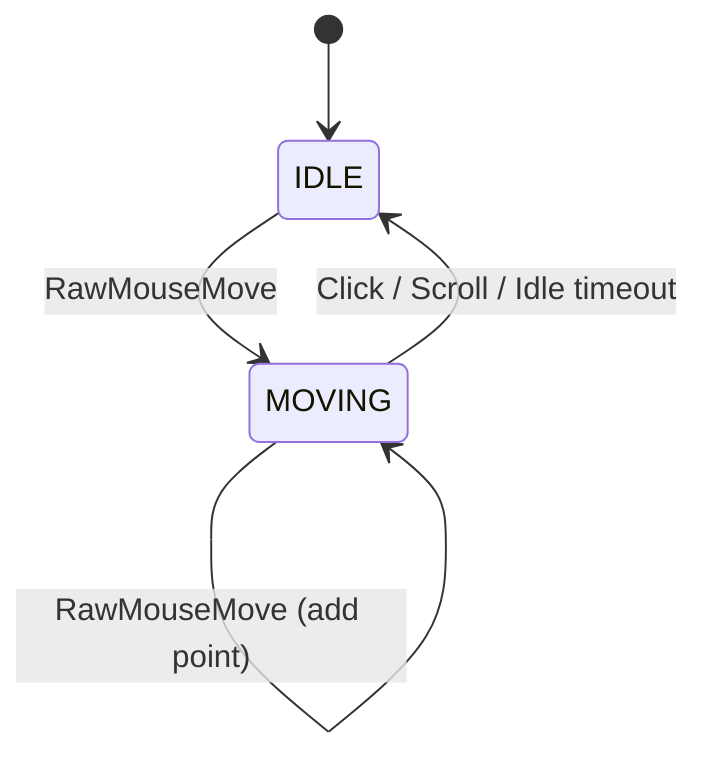
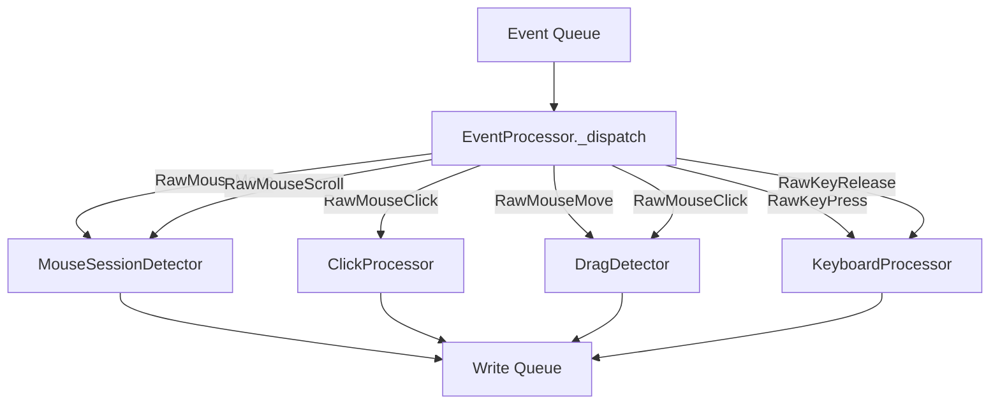

# processors/

Event processors that consume raw events from listeners and produce
structured records for the database.

All processors run in a single processor thread. The `EventProcessor`
class (in `__init__.py`) dispatches raw events to the appropriate
sub-processor based on event type.

<a id="folder-structure"></a>

## Folder Structure

```
📁 processors/
  📝 __processors.md
  🐍 __init__.py            ← EventProcessor (central dispatcher)
  🐍 mouse_session.py
  🐍 click_processor.py
  🐍 drag_detector.py
  🐍 keyboard_processor.py
```

<a id="files"></a>

## Files

### `__init__.py` — EventProcessor (Central Dispatcher)

Routes raw events from the shared queue to the correct sub-processor.
Runs in a dedicated thread. Also periodically checks idle/sequence
timeouts on sub-processors.

**Cross-record linking:** `ScrollEvent` is linked to the last completed movement's
app-generated ID at dispatch time. `ClickSequence.movement_id` is bound inside
`ClickProcessor` at the sequence's **first mouse-down** (passed in from the dispatcher),
not at finalize time — finalize happens `CLICK_SEQUENCE_GAP_MS` later and could
otherwise point to a movement that started after the clicks. When drag is first
confirmed, the dispatcher explicitly ends any active movement session (`end_for_drag()`).

**Drag vs click (phantom-click guard):** The dispatcher captures `was_dragging`
**before** calling `DragDetector.process_click`. A release that ends a drag resets
`is_dragging` to `False` inside that call, so a post-call check would let the drag's
release leak into `ClickProcessor` as a phantom click whose `press_duration` is the
entire drag. Guarding on the pre-call state prevents that.

**Session stamping:** `EventProcessor` stamps `recording_session_id` on every
keyboard/scroll/click record before queuing it (movements and drags encode the
session in their id instead). This lets post-processing attribute each event to a
recording session for fatigue / time-of-day / cross-modal analysis.

**Keyboard-layout tracking:** the listener resolves the active layout (HKL) on
every press; `_track_layout_change` emits a `SystemEventRecord`
(`keyboard_layout_hkl`) only when it changes — per-keystroke-accurate layout
attribution at near-zero cost, finer than the 10 s system-monitor poll.

**In-memory stats:** Maintains a `StatsTracker` instance with 19 named counters
(mouse + keyboard). Stats are updated on every processed event and read by the
dashboard timer. No database reads — all from RAM.

**Keystroke classification:** Non-modifier keystrokes are classified into categories
based on scan code and modifier state:

| Category | Condition |
|----------|-----------|
| `upper_keys` | Letter scan code + (Shift XOR CapsLock) |
| `lower_keys` | Letter scan code + not upper |
| `code_keys` | Brackets, operators, punctuation (CODE_SCANS) |
| `number_keys` | Number row (0-9) |
| `numpad_keys` | Numpad scan codes |
| `other_keys` | Everything else (space, enter, arrows, F-keys, shortcut keystrokes) |

**Word counting:** State machine tracking text→whitespace transitions. When a
non-modifier, non-whitespace key is followed by a whitespace key (Space, Tab,
Enter), the "words" counter increments.

**CapsLock tracking:** Initial state queried from OS via `GetKeyState(0x14)`,
then toggled on scan code 0x3A press.

### `mouse_session.py` — Movement Session Detector

Groups consecutive `RawMouseMove` events into movement sessions. A session
starts when the mouse first moves after being idle, and ends when:

| Trigger | `end_event` value |
|---------|-------------------|
| Left click | `"left_click"` |
| Right click | `"right_click"` |
| Middle click | `"middle_click"` |
| Scroll | `"scroll_up"`, `"scroll_down"`, etc. |
| Drag begins | `"drag"` |
| Idle timeout | `"idle"` |
| Shutdown | `"flush"` |

**State machine:**



Calculates basic metrics: duration, distance, path length, point count.

**Movement ID generation:** Each session gets an app-generated ID
(`session_num * 1_000_000 + seq`) that is known before DB write. This enables
clicks and scrolls to reference their preceding movement immediately.

**Downsampling:** When `DOWNSAMPLE_HZ` is set in config, intermediate path points
are filtered by time interval. First and last points always kept. Path length is
calculated from ALL raw points (full accuracy) before downsampling.

> **Note:** Does NOT calculate derived analytics (overshoot, speed profiles, curvature).
> Those are post-processing tasks.

### `click_processor.py` — Click Sequence Builder

Groups clicks into sequences: single click (1), double click (2), or
spam clicks (3+). Clicks within `CLICK_SEQUENCE_GAP_MS` of each other
are part of the same sequence.

**What it tracks per click:**

| Metric | Description |
|--------|-------------|
| `press_duration_ms` | Mouse down → mouse up |
| `delay_since_prev_ms` | Gap from previous click in sequence |
| `x, y` | Position at mouse down |
| `t_ns` | Precise timestamp |

### `drag_detector.py` — Drag Operation Detector

Detects click-hold-move-release patterns. If the mouse moves more than
`DRAG_MIN_DISTANCE_PX` while a button is held down, it's classified as a
drag operation instead of a click. Records the full drag path.

> **Note:** When a drag is active, mouse moves are consumed by the drag detector
> and NOT forwarded to the session detector. This prevents drag paths from
> being counted as regular movement sessions.

### `keyboard_processor.py` — Keystroke & Transition Tracker

Processes keyboard events to produce three record types:

| Record Type | What it captures |
|-------------|------------------|
| `KeystrokeRecord` | Individual key press: scan code, press duration, modifier bitmask |
| `KeyTransitionRecord` | Delay between consecutive keys (scan code pairs), `is_repeat` flag |
| `ShortcutRecord` | Modifier+key combo with full timing profile, actual release order |

**Auto-repeat handling:** The OS fires repeated key-down events while a key is held.
The listener tags these (`RawKeyPress.is_repeat`), and `process_press` keeps them out
of digraph timing and shortcut state: it does **not** update the last-key / modifier /
main-key timestamps on a repeat, so ~30 ms repeat intervals never pollute flight-time
distributions or overwrite a shortcut's press times. A repeat is instead recorded as a
single `KeyTransitionRecord` with `from_scan == to_scan` and `is_repeat=1` — a
hold-to-repeat behavioral signal, excluded from digraph stats in ML preprocessing.
Repeats produce no extra `KeystrokeRecord` (only the single release does).

**Shortcut timing validation:** `_try_emit_shortcut` validates all computed durations
before emitting. Negative `main_hold` or `total` indicate stale processor state
(impossible in correct execution) — the record is **dropped** and an `ERROR` is logged
with full timing state for diagnosis. Negative `mod_to_main` (main key registered before
modifier in a near-simultaneous press) is a physically plausible edge case — a `WARNING`
is logged and the value is clamped to 0, but the record is kept.

**Typing mode detection:**

| Mode | Condition |
|------|-----------|
| `"shortcut"` | Active modifier (ctrl/alt/win) |
| `"numpad"` | Numpad scan codes |
| `"code"` | Brackets, operators, etc. |
| `"text"` | Default — letters, spaces |

**Exported scan code sets** (used by `EventProcessor` for keystroke classification):

| Constant | Contents |
|----------|----------|
| `MODIFIER_SCANS` | Shift, Ctrl, Alt, Win scan codes |
| `NUMPAD_SCANS` | Numpad 0-9, operators, dot, Enter |
| `CODE_SCANS` | Brackets, operators, punctuation |
| `LETTER_SCANS` | A-Z (QWERTY rows) |
| `NUMBER_ROW_SCANS` | Number row 1-0 |
| `WHITESPACE_SCANS` | Space, Tab, Enter, Numpad Enter |
| `CAPSLOCK_SCAN` | CapsLock key (0x3A) |

<a id="event-flow"></a>

## Event Flow



<a id="what-recorder-does-not-do"></a>

## What the Recorder Does NOT Calculate

These are all post-processing tasks:

| Metric | Why not in recorder |
|--------|---------------------|
| Curvature ratio | Derived from path points |
| Avg/max speed | Derived from path points + timestamps |
| Overshoot detection | Requires analyzing movement endpoint vs click |
| Pre-click pause | Derived from last path point timestamp vs click timestamp |
| Jitter metrics | Statistical analysis of path points |
| Speed profiles | Requires windowed calculations across path |
