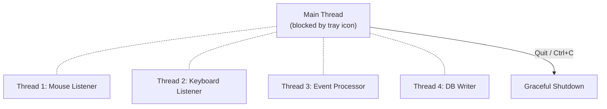

# ui/

System tray interface for the recorder. Provides minimal visual feedback
and controls without a full window — the recorder runs silently in the
background with just a tray icon.

<a id="folder-structure"></a>

## Folder Structure

```
📁 ui/
  📝 README.md
  🐍 __init__.py
  🐍 tray_icon.py
```

<a id="files"></a>

## Files

### `tray_icon.py` — System Tray Icon & Menu

Uses `pystray` + `Pillow` to show a colored circle in the Windows
notification area (system tray).

**Icon states:**

| Color | Hex | State |
|-------|-----|-------|
| 🟢 Green | `#22c55e` | Actively recording |
| 🟡 Yellow | `#eab308` | Paused (via hotkey or menu) |
| 🔴 Red | `#ef4444` | Stopped or error |

**Right-click menu:**

| Menu Item | Action |
|-----------|--------|
| **Pause / Resume** | Toggles recording on/off. Label updates dynamically. |
| **Stats** | Shows a Windows toast notification with current counts: movements, clicks, keystrokes, DB queue depth. |
| **Quit** | Graceful shutdown: stops listeners → flushes DB writer → updates recording session → exits. |

<a id="threading"></a>

## Threading



`pystray` requires `Icon.run()` to block the main thread on Windows.
All other components (listeners, processor, writer) run in daemon threads.
When the tray icon stops (via Quit or Ctrl+C), the main thread unblocks
and triggers graceful shutdown.

<a id="why-not-a-full-gui"></a>

## Why Not a Full GUI?

The recorder is designed to run invisibly. A full window would be
distracting and unnecessary — all you need to know is:

| Question | Answer |
|----------|--------|
| Is it recording? | 🟢 Green icon |
| How much data so far? | Stats menu → toast notification |
| How to pause/stop? | Right-click menu or `Ctrl+Alt+R` |

The separate `gui/` package handles the full PySide6 dashboard for
user profiles, training, and validation — that's a different concern.
