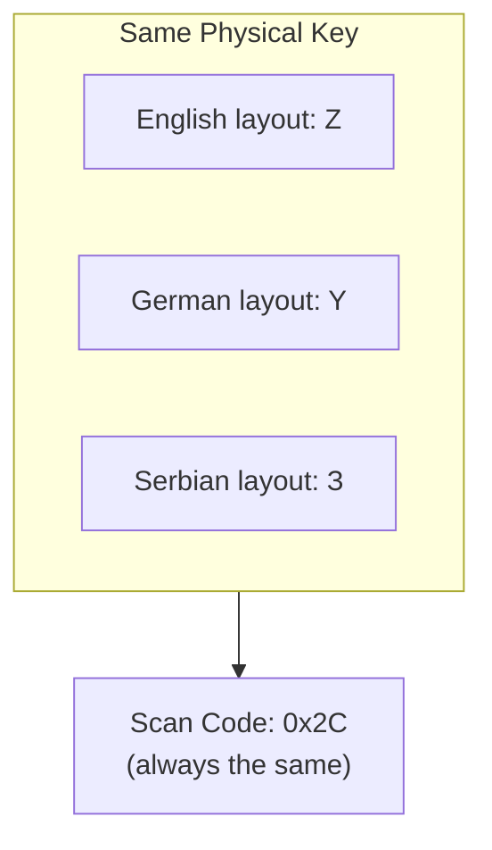

# utils/

Utility modules shared across the entire recorder. These are pure helper
functions with no state — any module can import and use them freely.

<a id="folder-structure"></a>

## Folder Structure

```
📁 utils/
  📝 __utils.md
  🐍 __init__.py
  🐍 timing.py
  🐍 keyboard_layout.py
  🐍 system_monitor.py
  🐍 stats_tracker.py
```

<a id="files"></a>

## Files

### `timing.py` — Timestamp Utilities

All timing in the recorder goes through this module. Provides a consistent
API for getting the current time and converting between units.

**Functions:**

| Function | Returns | Description |
|----------|---------|-------------|
| `now_ns()` | `int` | `time.perf_counter_ns()` — monotonic nanosecond timestamp |
| `ns_to_ms(ns)` | `float` | Convert nanoseconds to milliseconds |
| `interval_ms(t1, t2)` | `float` | Milliseconds between two `perf_counter_ns` timestamps |
| `wall_clock_iso()` | `str` | Current wall clock as ISO 8601 string |

> **Warning:** `wall_clock_iso()` is ONLY for human-readable `timestamp` columns.
> NEVER use it for timing calculations — wall clock can jump due to NTP, DST, etc.

### `keyboard_layout.py` — Physical Keyboard Map

Maps scan codes to physical key positions on the keyboard. Scan codes
represent PHYSICAL key locations — the same scan code always refers to
the same physical key regardless of which language layout is active
(English, Serbian Latin, Serbian Cyrillic, etc.).

**Map format:** `scan_code → (hand, finger, row, col)`

| Field | Values | Description |
|-------|--------|-------------|
| `hand` | 0=left, 1=right | Which hand presses this key |
| `finger` | 0=pinky, 1=ring, 2=middle, 3=index, 4=thumb | Which finger |
| `row` | -1 to 4 | Keyboard row (-1=F-keys, 0=numbers, 1=QWERTY, 2=home, 3=bottom, 4=space) |
| `col` | 0+ | Column position left to right |

**Functions:**

| Function | Returns | Description |
|----------|---------|-------------|
| `infer_hand(scan_code)` | `str` | `"left"` / `"right"` / `"unknown"` |
| `infer_finger(scan_code)` | `str` | `"pinky"` / `"ring"` / `"middle"` / `"index"` / `"thumb"` / `"unknown"` |
| `same_hand(sc1, sc2)` | `bool?` | Whether two keys are pressed by the same hand |
| `same_finger(sc1, sc2)` | `bool?` | Whether two keys are pressed by the same finger |
| `physical_distance(sc1, sc2)` | `float?` | Approximate distance in mm (19.05mm key pitch) |
| `get_position(scan_code)` | `tuple?` | `(row, col)` grid position |

**Coverage:** Full alphanumeric, function keys, navigation cluster, arrow keys, numpad.

### `stats_tracker.py` — In-Memory Stats Counters

Tracks recording statistics in RAM for dashboard display. No database reads.
Two classes:

| Class | Purpose |
|-------|---------|
| `TimeWindowCounter` | Per-minute circular buffer (60 slots). Supports rolling window queries: "how many events in the last N minutes?" Fixed memory. |
| `StatsTracker` | Named counters with both lifetime totals and per-minute windowed counts. Single writer (processor thread) + single reader (Qt timer thread), thread-safe under CPython GIL. |

**Counter names managed by `EventProcessor`:**

| Group | Counters |
|-------|----------|
| Mouse | `movements`, `clicks`, `left_clicks`, `right_clicks`, `middle_clicks`, `double_clicks`, `triple_clicks`, `spam_clicks`, `drags`, `scrolls` |
| Keyboard | `keystrokes`, `upper_keys`, `lower_keys`, `code_keys`, `number_keys`, `numpad_keys`, `other_keys`, `shortcuts`, `words` |

### `system_monitor.py` — System State Monitor

Periodically checks system settings that affect input behavior and emits
`SystemEventRecord` when a value changes. Also provides `PollingRateEstimator`
for estimating mouse polling rate from move event timestamps.

**Monitored settings:**

| Setting | Windows API | Example value |
|---------|-------------|---------------|
| Mouse speed (1-20) | `SystemParametersInfoW(SPI_GETMOUSESPEED)` | `"10"` |
| Mouse acceleration | `SystemParametersInfoW(SPI_GETMOUSE)` | `"True"` / `"False"` |
| Screen resolution | `GetSystemMetrics` | `"1920x1080"` |
| Keyboard layout | `GetKeyboardLayout` | `"0x04090409"` |
| Mouse button 4 label | `config.MOUSE_BUTTON4_LABEL` | `"Back"` |
| Mouse button 5 label | `config.MOUSE_BUTTON5_LABEL` | `"Forward"` |

**Classes:**

| Class | Purpose |
|-------|---------|
| `SystemMonitor` | Polls system state, emits `SystemEventRecord` on change |
| `PollingRateEstimator` | Estimates mouse Hz from move event intervals (rolling window, continuous) |

**`PollingRateEstimator` design:**

Maintains a rolling `deque` of the last `POLLING_RATE_SAMPLE_COUNT` (300) valid
inter-event intervals. Two filters prevent garbage from entering the window:

| Filter | Threshold | Removes |
|--------|-----------|---------|
| Min | `POLLING_RATE_MIN_INTERVAL_NS` (125 μs) | OS burst-delivery artifacts |
| Max | `POLLING_RATE_MAX_INTERVAL_NS` (20 ms) | Idle gaps / slow cursor movement |

Calculation uses **median** of the window, snapped to the nearest standard rate
(125, 250, 500, 1000, 2000, 4000, 8000 Hz). The first estimate fires as soon as
the window fills; subsequent recalculations respect a cooldown
(`POLLING_RATE_UPDATE_INTERVAL_S`, default 60 s) so a corrected estimate is
eventually picked up without constant CPU work.

`start_polling_estimation()` starts a daemon pynput listener that runs for the
entire login session. It returns a `stop()` callable — call it on logout.
The `on_done(hz)` callback is fired every time the snapped estimate **changes**
(not just on the first result), so the dashboard stays current.

<a id="why-scan-codes"></a>

## Why Scan Codes Matter



Virtual key codes change meaning when you switch keyboard layouts.
But the PHYSICAL key in that position always has the same scan code.

For ML training, we care about physical finger movement — the delay
between pressing two keys depends on their physical distance, not what
character they produce. So all timing analysis uses scan codes.

| Property | Virtual Key (vk) | Scan Code |
|----------|------------------|-----------|
| Layout-dependent? | ✅ Yes | ❌ No |
| Represents | Character produced | Physical position |
| Used for | Display name only | ML timing analysis |
